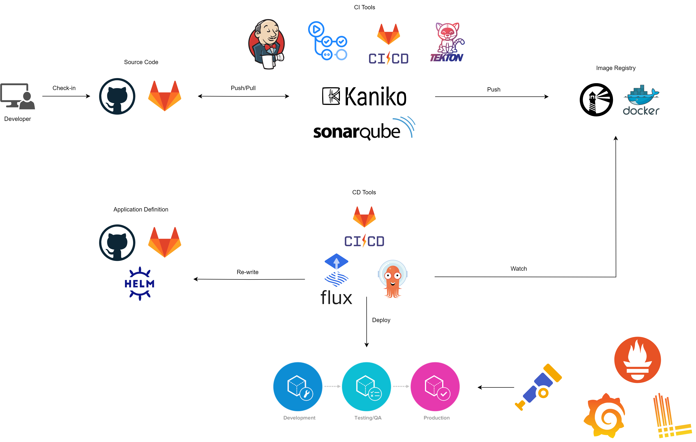

## DevSecOps

A "one-click-to-start" CI/CD pipeline powered by [Terraform](https://www.terraform.io/) & [Tecent Cloud](https://cloud.tencent.com/?mobile&lang=en).

:smile: **This project is in progress, we would appreciate your precious ideas & suggestions to make it better.**

### **Disclaimer**

**You may incur some charges by setting up this pipeline, proceed with caution should you have any concerns.** :pray:

### **Content Removal Declaration**

If any content in this project infringes upon your rights or intellectual property, please notify us immediately. We are committed to respecting all legal rights and will promptly remove any infringing material upon verification. Please contact us with the relevant details, and we will address the issue as soon as possible.

### Architecture



### Features

Ingress HTTPS powered by [cert-manager](https://cert-manager.io/), [Let's Encrypt](https://letsencrypt.org/) & [Cloudflare](https://www.cloudflare.com/) and [sealed-secrets](https://github.com/bitnami-labs/sealed-secrets).


### Limitation

- Currently only Harbor supports HTTPS.
- Let's Encrypt regulates up to 5 certificates can be issued per exact same set of hostnames every 7 days. See more in [Limit](https://letsencrypt.org/docs/rate-limits/#new-certificates-per-exact-set-of-hostnames). So please don't tear-down & re-create your pipeline frequently, or you may switch to Harbor HTTP, which is by default.
- Currently we do not support [`terraform{}.cloud`](https://developer.hashicorp.com/terraform/language/terraform#terraform-cloud) for HCP Terraform & Terraform Enterprise.

### Deploy

#### Env

Host: 

- Windows11 v23H2
- [WSL2](https://learn.microsoft.com/en-us/windows/wsl/install) Ubuntu-22.04
- [Docker Desktop](https://www.docker.com/products/docker-desktop/) v4.28.0

#### Command line tool

Note: some of these are not necessary but you would need them anyway while you are going through the entire workflow.

- [kubectl](https://kubernetes.io/docs/reference/kubectl/)
- [helm](https://helm.sh/docs/intro/install/)
- [terraform](https://developer.hashicorp.com/terraform/install)
- [kubeseal](https://github.com/bitnami-labs/sealed-secrets?tab=readme-ov-file#kubeseal)

#### Setup

Export env for Tencent Cloud [access credentials](https://www.tencentcloud.com/document/product/598/32675). 

It's recommended to add them into your shell configuration file, for example `~/.zshrc`.

```bash
export TF_VAR_secret_id="..."
export TF_VAR_secret_key="..."
```

Create a file named `terraform.tfvars` locally to store your sensitive data.

```bash
cd iac
touch terraform.tfvars
```

```bash
# terraform.tfvars

# cloudflare
# free domain in https://register.us.kg/
domain               = "..."

# https://dash.cloudflare.com/
# https://developers.cloudflare.com/fundamentals/api/get-started/create-token/
# Permission:     Zone/Zone/Read, Zone/DNS/Edit
# Zone Resources: Include/All zones
cloudflare_api_token = "..."

# github
github_username      = "..."

# https://docs.github.com/en/authentication/keeping-your-account-and-data-secure/managing-your-personal-access-tokens
github_pat           = "..."
```

Note: feel free to customize any variables in `variables.tf` or/and files under `module/` directory to build your own Terraform project.

If you want to enable Harbor HTTPS. Modify `helm_harbor.tf` then un-comment `helm_cert_manager.tf` & `helm_sealed_secret.tf`.

```json
// https://goharbor.io/docs/2.0.0/install-config/harbor-ha-helm/
resource "helm_release" "harbor" {
  name             = "harbor"
  repository       = "https://helm.goharbor.io"
  chart            = "harbor"
  namespace        = "harbor"
  version          = "v1.16.0"
  create_namespace = true

  values = [
    "${templatefile(
      "./helm_harbor/https-values.yaml.tpl",   // modify to https
      {
        "prefix" : "${var.prefix}"
        "domain" : "${var.domain}"
        "harbor_pwd" : "${var.harbor_pwd}"
      }
    )}"
  ]

  depends_on = [helm_release.ingress-nginx]
}
```

#### Apply

```bash
# need approval
terraform apply

# or auto
terraform apply --auto-approve
```

#### Verify

```bash
# export env in a single terminal
export KUBECONFIG=./config.yaml

# list namespaces
kubectl get ns
```

```bash
# get urls
terraform output
```

#### clean-up

```bash
terraform state rm helm_release.cert-manager
terraform state rm helm_release.harbor
terraform state rm helm_release.ingress-nginx
terraform state rm helm_release.sealed-secrets
terraform state rm helm_release.jenkins
terraform state rm helm_release.sonarqube
terraform state rm helm_release.argo-cd
terraform state rm "module.k3s"
terraform destroy --auto-approve
```

### [Tutorial](https://github.com/KokoiRuby/devsecops/tree/main/tutorial) :point_left::nerd_face:

### Q&A

> Why not merge all `helm_*.tf` & `helm_*/` into a single file & directory?

Simply to modul-ize and make it easy to manage rather than stuffing them into a single room. If you don't need any one of modules, simply comments all lines in `helm_*.tf` file.

> Why not use one-line `helm` command instead of [helm_release](https://registry.terraform.io/providers/hashicorp/helm/latest/docs/resources/release)?

To be honest, `helm` command is much simpler then [helm_release](https://registry.terraform.io/providers/hashicorp/helm/latest/docs/resources/release), we could even include everything into a init script & run it during the cloud vm boot-up phase. However, we'd like to stick to the mindset of "IaC" where resource as a single unit to manage. Anyway, it varies from person to person, and no matter which practice.

### Contribution

Geekbang DevOps Camp - [lyzhang1999](https://github.com/lyzhang1999)

### TODO

