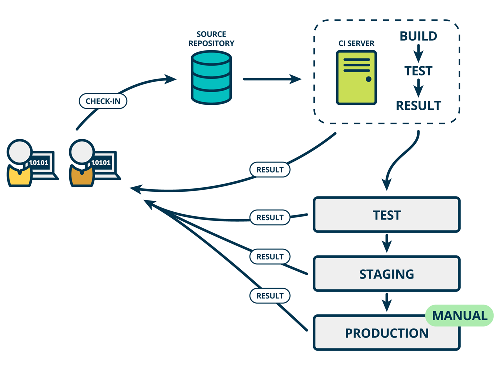
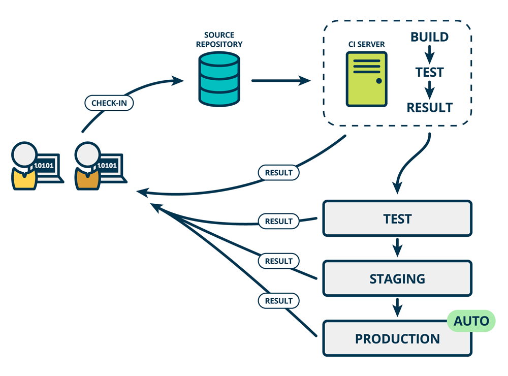

## CD

A practice that emphasizes the ongoing and iterative process of releasing software updates and improvements. 

- ENV definition & elevation (dev → test → pre-release → prod)

vs.

- **Continuous Delivery** refers to deploying integrated code to a "prod-like env" then to prod manually.
  - Quality/Stability > Release efficiency
  - Release process may be interrupted
  - Ticket → DevOps team provides pipelines
- **Continuous Deployment** takes **a step further** by **automating** the process of deploying to the prood-env.
  - High automation, Fast release speed
  - "Left-shift" quality (to dev)
  - Less prone to process interruptions

### Best practice

- **Separate biz src code & app def repo**

  - Separate the responsibilities/concerns of development and DevOps to avoid CI trigger issues caused by merging

    Clearer change logs for application definitions

  - Achieve access separation for better permission control

- **Dir-as-a-Env**

  - Easier rollback operations
  - Clear audit logs
  - Easy integration of automation
  - ApplicationSet + Generator (List/Git/PR)