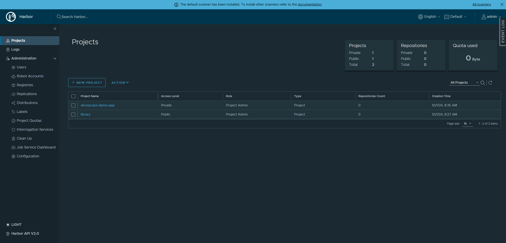
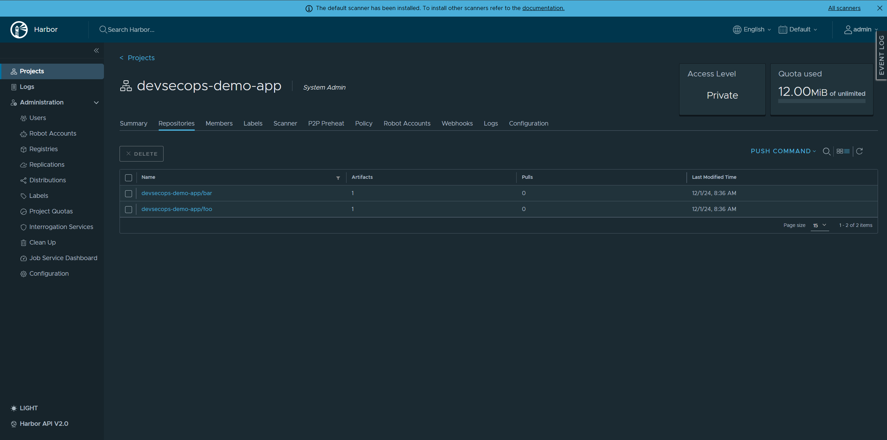

## ArgoCD

Argo CD is a declarative, GitOps continuous delivery tool for Kubernetes. [CLI](https://argo-cd.readthedocs.io/en/stable/cli_installation/)

The Application CRD is the Kubernetes resource object representing **a deployed application instance** in an environment.

### [GitOps](https://about.gitlab.com/topics/gitops/)

A continuous delivery approach that uses **Git as the single source of truth** for both infra (IaC) & app def (manifest/helm/kustomize). Check diff = current vs. desired state then drive to desired state.


### Sync

> Reconcile every 3 min by default

Triggers:

1. Modify application definition (helm) repo manually.
2. Modify application definition (helm) repo by CI pipeline, or create a separate pipeline to modify repo automatically. (tag as input)

Sync [options](https://argo-cd.readthedocs.io/en/latest/user-guide/sync-options/) via annotations.


### Image Updater

[Image Updater](https://argocd-image-updater.readthedocs.io/en/stable/) via [annotations](https://argocd-image-updater.readthedocs.io/en/stable/configuration/images/) - **Registry pull secret is required**. (modify `values.yaml` in app def repo won't trigger sync)

Webhook → GitHub

### [GitOps](https://about.gitlab.com/topics/gitops/)

A continuous delivery approach that uses **Git as the single source of truth** for both infra (IaC) & app def (manifest/helm/kustomize).

Check diff = current vs. desired state then drive to desired state.

### Hands-on

> Demo app src  [repository](https://github.com/KokoiRuby/devsecops-demo-app)
>
> Demo app helm [repository](https://github.com/KokoiRuby/devsecops-demo-app-helm)

#### Demo#1

> Create & sync dev env by creating an argocd application.

Upload images to harbor first.

```bash
# login
docker login harbor.devsecops.yukanyan.us.kg -u admin -p admin
```

```bash
# tag
docker tag <image_hash> harbor.devsecops.yukanyan.us.kg/devsecops-demo-app/foo:v0.1.0
docker tag <image_hash> harbor.devsecops.yukanyan.us.kg/devsecops-demo-app/bar:v0.1.0
```

```bash
# push
docker push harbor.devsecops.yukanyan.us.kg/devsecops-demo-app/foo:v0.1.0
docker push harbor.devsecops.yukanyan.us.kg/devsecops-demo-app/bar:v0.1.0
```

Check on harbor dashboard.





Go to tutorial directory & export kubeconfig env.

```bash
cd tutorial/cd/argo-cd
export KUBECONFIG=../../../iac/config.yaml
```

Copy demo values.yaml under to demo app helm repository.


Check "Repositories" in argocd dashboard. You would see a pre-added entry which was created by a secret during iac phase.


You might also try argo cli.

```bash
# loging
argocd login argocd.devsecops.yukanyan.us.kg

# list repo
argocd repo list
```

Add, Commit & Push.

```bash
git add .
git commit -m "argocd demo1"
git push -u origin main
```

Then apply argocd application.

```bash
kubectl apply -f manifest/demo1-application.yaml
```

Check on argocd dashboard.


Verify URL.

- http://demo-app-dev.devsecops.yukanyan.us.kg/foo

- http://demo-app-dev.devsecops.yukanyan.us.kg/bar

Modify `demo1-values.yaml` in demo app helm repo. Add, Commit & Push again.

```yaml
foo:
  replicaCount: 2

bar:
  replicaCount: 2
```

```bash
git add .
git commit -m "argocd demo1 replica++"
git push -u origin main
```

Check on argocd dashboard.


In the end, rollback & prepare for the next demo.

```bash
kubectl delete -f manifest/demo1-application.yaml
```

```bash
# rollback
git reset --hard <recorded_commit_hash>
git push --force
```

#### Demo#2

> Update image tag by Jenkins pipeline.

Create a pipeline on jenkins dashboard.


Copy content of `Jenkinsfile-demo2` into.


Manually trigger build & cancel.


"Build with Parameters" in left tab.


Check demo app helm repo.


In the end, rollback & prepare for the next demo.

```bash
# rollback
git reset --hard <recorded_commit_hash>
git push --force
```

#### Demo#3

> Image updater

Update interval in deployment `argocd-image-updater`.

```bash
kubectl edit deploy argocd-image-updater -n argo-cd
```

```yaml
 37       containers:
 38       - args:
 39         - run
 40         - '--interval'  # ++
 41         - 30s           # ++
 42         env:
 43         - name: APPLICATIONS_API
```

Copy demo values.yaml under to demo app helm repository.


Add, Commit & Push.

```bash
git add .
git commit -m "argocd demo3 values.yaml"
git push -u origin main
```

Then apply argocd application.

```bash
kubectl apply -f manifest/demo3-application.yaml
```

Check on argocd dashboard.


Modify source `foo/templates/index.html`.

```html
<div class="version-info">v0.1.3</div>
```

Build & Push image to harbor.

```bash
cd foo

# login
docker login harbor.devsecops.yukanyan.us.kg -u admin -p admin

# build
docker build -t harbor.devsecops.yukanyan.us.kg/devsecops-demo-app/foo:v0.1.3 .

# push
docker push harbor.devsecops.yukanyan.us.kg/devsecops-demo-app/foo:v0.1.3
```

Check on harbor dashboard.


#### demo#4

#### demo#5

#### demo#6
