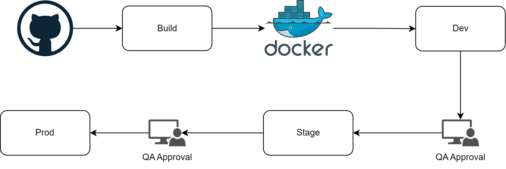
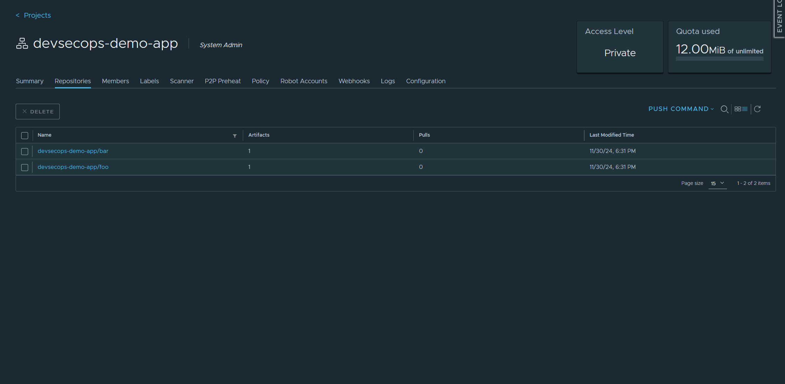
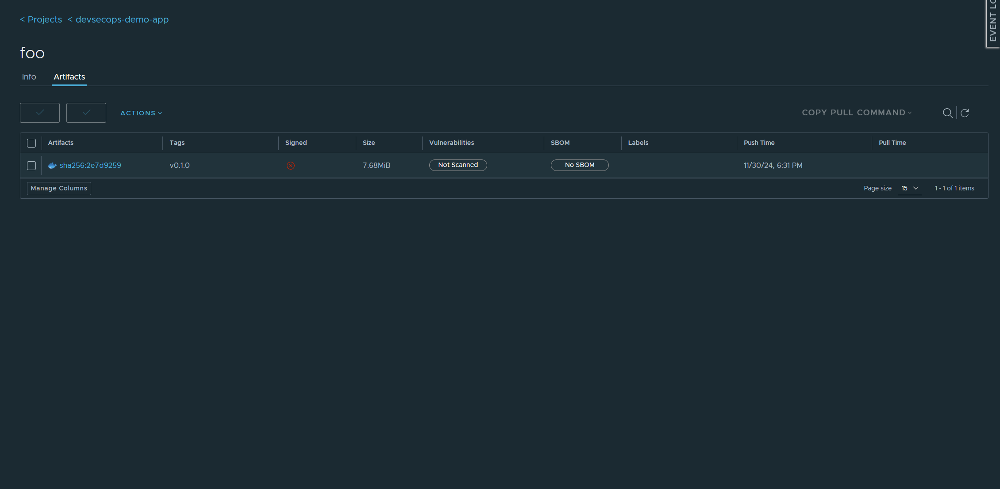
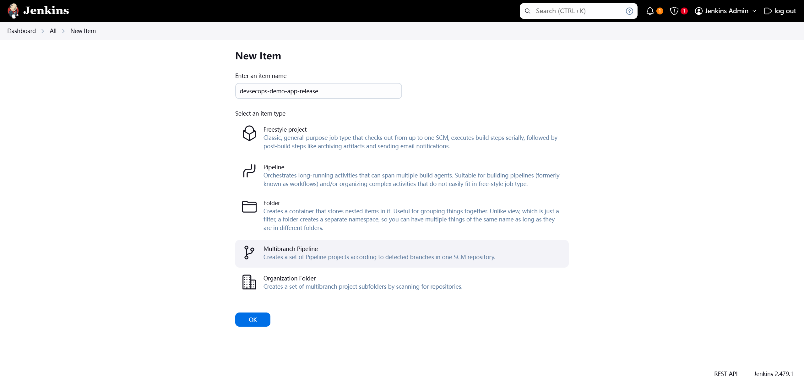
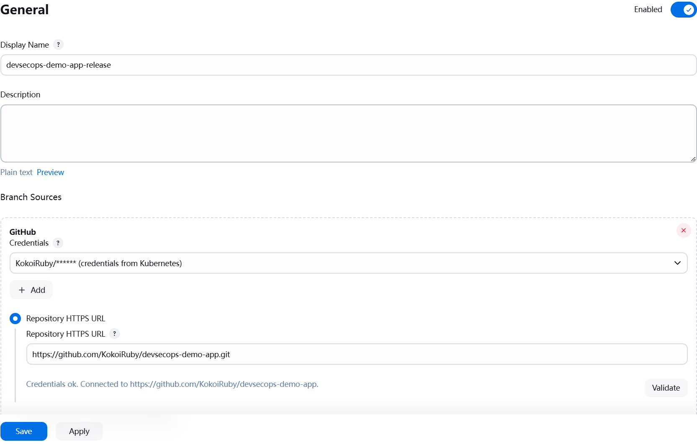
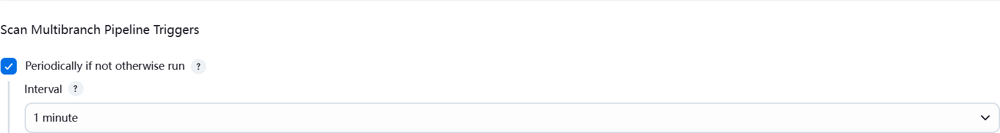
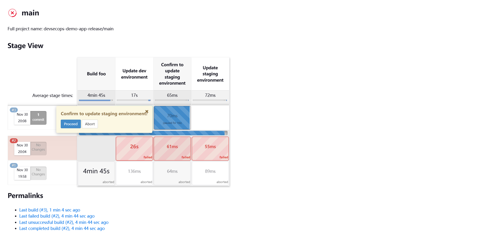
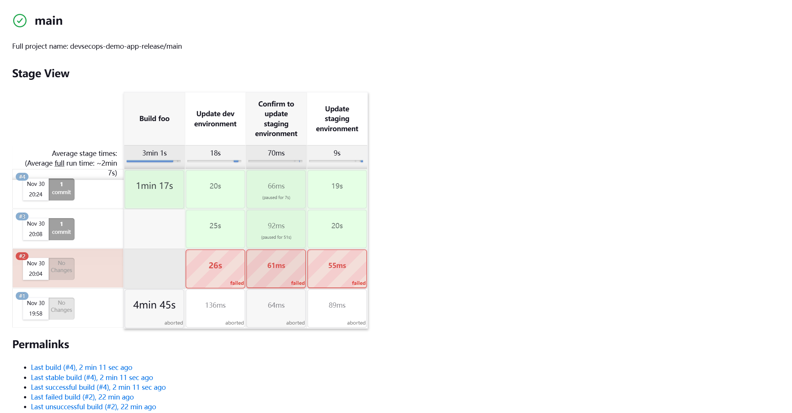

## Jenkins

### Hands-on

> Demo app src  [repository](https://github.com/KokoiRuby/devsecops-demo-app)
>
> Demo app helm [repository](https://github.com/KokoiRuby/devsecops-demo-app-helm)

#### Demo#1

:thumbsdown:

- New env→ re-design pipeline
- No env definition
- Hard to trace deployment actions, rollback complexity is high
- Unable to adapt new requirement such as: temp env, env destory...



Upload images to harbor first.

```bash
# login
docker login harbor.devsecops.yukanyan.us.kg -u admin -p admin
```

```bash
# tag
docker tag <image_hash> harbor.devsecops.yukanyan.us.kg/devsecops-demo-app/foo:v0.1.0
docker tag <image_hash> harbor.devsecops.yukanyan.us.kg/devsecops-demo-app/bar:v0.1.0
```

```bash
# push
docker push harbor.devsecops.yukanyan.us.kg/devsecops-demo-app/foo:v0.1.0
docker push harbor.devsecops.yukanyan.us.kg/devsecops-demo-app/bar:v0.1.0
```

Check on harbor dashboard.






Install demo app into dev & stage namespace. Note: copy `config.yaml` generated by iac to helm repository directory.

```bash
export KUBECONFIG=config.yaml
```

```bash
## dev
helm install devsecops-demo-app-dev . \
	-n dev --create-namespace \
	-f demo1-values.dev.yaml

## stage
helm install devsecops-demo-app-stage . \
	-n stage --create-namespace \
	-f demo1-values.stage.yaml
```

Verify

- http://demo-app-dev.devsecops.yukanyan.us.kg/foo
- http://demo-app-dev.devsecops.yukanyan.us.kg/bar
- http://demo-app-stage.devsecops.yukanyan.us.kg/foo
- http://demo-app-stage.devsecops.yukanyan.us.kg/bar

Create `Jenkinsfile` in demo app source repo.

```groovy
pipeline {
    agent none
    stages {
        stage('Build foo') {
            when {
                changeset "**/foo/**"
            }
            agent {
                kubernetes {
                    defaultContainer 'kaniko'
                    yaml """
kind: Pod
spec:
  containers:
  - name: kaniko
    image: gcr.io/kaniko-project/executor:v1.23.2-debug
    imagePullPolicy: Always
    command:
    - sleep
    args:
    - 99d
    volumeMounts:
      - name: jenkins-docker-cfg
        mountPath: /kaniko/.docker
  volumes:
  - name: jenkins-docker-cfg
    projected:
      sources:
      - secret:
          name: regcred
          items:
            - key: .dockerconfigjson
              path: config.json
"""
                }
            }

            environment {
                HARBOR_URL     = credentials('harbor-url')
                IMAGE_PUSH_DESTINATION="${HARBOR_URL}/devsecops-demo-app/foo"
                GIT_COMMIT="${checkout (scm).GIT_COMMIT}"
                IMAGE_TAG = "${BRANCH_NAME}-${GIT_COMMIT}"
                BUILD_IMAGE="${IMAGE_PUSH_DESTINATION}:${IMAGE_TAG}"
                BUILD_IMAGE_LATEST="${IMAGE_PUSH_DESTINATION}:latest"
            }

            steps {
                container(name: 'kaniko', shell: '/busybox/sh') {
                    withEnv(['PATH+EXTRA=/busybox']) {
                        sh '''#!/busybox/sh
                            cd foo
                            /kaniko/executor --context `pwd` --destination $BUILD_IMAGE --insecure
                        '''
                    }
                }
            }
        }

        stage('Update dev environment') {
            agent {
                kubernetes {
                    defaultContainer 'kubectl'
                    yaml """
kind: Pod
spec:
  serviceAccountName: jenkins-kubeconfig
  securityContext:
    runAsUser: 1000
  containers:
  - name: kubectl
    image: jitesoft/kubectl:v1.31
    imagePullPolicy: Always
    command:
    - sleep
    args:
    - 99d
"""
                }
            }

            environment {
                HARBOR_URL     = credentials('harbor-url')
                IMAGE_PUSH_DESTINATION="${HARBOR_URL}/devsecops-demo-app/foo"
                GIT_COMMIT="${checkout (scm).GIT_COMMIT}"
                IMAGE_TAG = "${BRANCH_NAME}-${GIT_COMMIT}"
                BUILD_IMAGE="${IMAGE_PUSH_DESTINATION}:${IMAGE_TAG}"
                BUILD_IMAGE_LATEST="${IMAGE_PUSH_DESTINATION}:latest"
            }

            steps {
                container(name: 'kubectl', shell: '/bin/sh') {
                    sh '''#!/bin/sh
                        kubectl set image deployment/devsecops-demo-app-foo result=$BUILD_IMAGE -n dev
                    '''
                }
            }
        }

        // simulate QA approval
        stage("Confirm to update staging environment") {
            steps {
                input "Confirm to update staging environment?"
            }
        }

        stage('Update staging environment') {
            agent {
                kubernetes {
                    defaultContainer 'kubectl'
                    yaml """
kind: Pod
spec:
  serviceAccountName: jenkins-kubeconfig
  securityContext:
    runAsUser: 1000
  containers:
  - name: kubectl
    image: jitesoft/kubectl:v1.31
    imagePullPolicy: Always
    command:
    - sleep
    args:
    - 99d
"""
                }
            }

            environment {
                HARBOR_URL     = credentials('harbor-url')
                IMAGE_PUSH_DESTINATION="${HARBOR_URL}/devsecops-demo-app/foo"
                GIT_COMMIT="${checkout (scm).GIT_COMMIT}"
                IMAGE_TAG = "${BRANCH_NAME}-${GIT_COMMIT}"
                BUILD_IMAGE="${IMAGE_PUSH_DESTINATION}:${IMAGE_TAG}"
                BUILD_IMAGE_LATEST="${IMAGE_PUSH_DESTINATION}:latest"
            }

            steps {
                container(name: 'kubectl', shell: '/bin/sh') {
                    sh '''#!/bin/sh
                        kubectl set image deployment/devsecops-demo-app-foo result=$BUILD_IMAGE -n stage
                    '''
                }
            }
        }
    }
}
```

Create a multibranch pipeline on jenkins dashboard.







Modify source `foo/templates/index.html`.

```bash
<div class="version-info">v0.1.2</div>
```

Add, Commit & Push.

```bash
git add .
git commit -m "jenkins cd build v0.1.2"
git push -u origin main
```

QA approval.



Pushed & updated successfully.




Verify.

- http://demo-app-dev.devsecops.yukanyan.us.kg/foo
- http://demo-app-stage.devsecops.yukanyan.us.kg/foo

In the end, rollback & prepare for the next demo.

```bash
# rollback
git reset --hard <recorded_commit_hash>
git push --force
```

```bash
# clean-up
helm uninstall devsecops-demo-app-dev -n dev
helm uninstall devsecops-demo-app-stage -n stage
```

