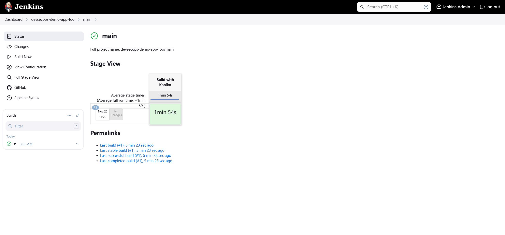
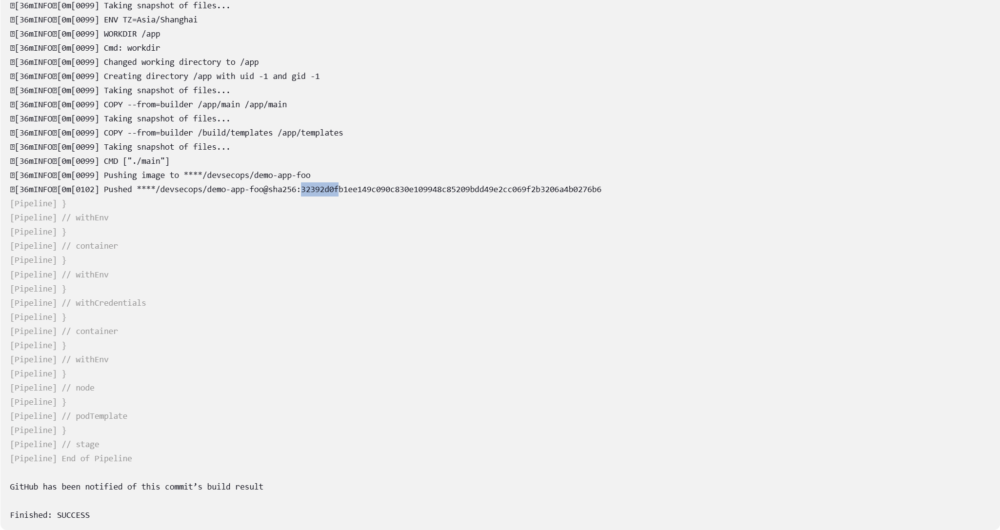
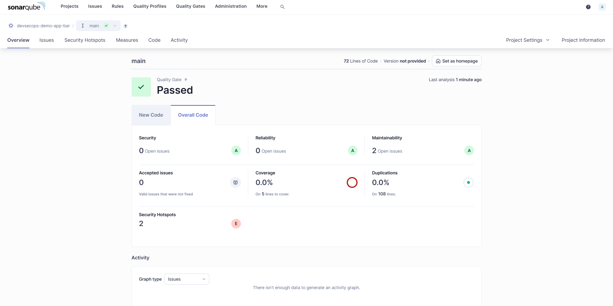

## [Jenkins](https://www.jenkins.io/doc/)

Jenkins is a self-contained, open source automation server which can be used to automate all sorts of tasks related to building, testing, and delivering or deploying software.

### [`Jenkinsfile`](https://www.jenkins.io/doc/book/pipeline/jenkinsfile/)

A `Jenkinsfile` is a text file that contains the definition of a Jenkins Pipeline and is checked into source control.

```groovy
pipeline {
    agent any

    stages {
        stage('Build') {
            steps {
                echo 'Building..'
            }
        }
        stage('Test') {
            steps {
                echo 'Testing..'
            }
        }
        stage('Deploy') {
            steps {
                echo 'Deploying....'
            }
        }
    }
}
```

### [Kaniko](https://github.com/GoogleContainerTools/kaniko)

A tool to build container images from a Dockerfile, inside a container or Kubernetes cluster.

It **doesn't depend on a Docker daemon** and executes each command within a Dockerfile completely in userspace.

### [Plugins](https://plugins.jenkins.io/)

### Hands-on

> Demo App GitHub [repository](https://github.com/KokoiRuby/devsecops-demo-app)

#### Credentials

```bash
# harbor pullsecret which will be mounted to Kaniko container /kaniko/.docker
kubectl get secret harbor-pullsecret -n jenkins -o yaml
```

```bash
# git checkout
# https://jenkinsci.github.io/kubernetes-credentials-provider-plugin/
kubectl get secret jenkins-github-pat -n default -o yaml
kubectl get secret jenkins-github-pat-text -n default -o yaml
```

```bash
# harbor url
# https://jenkinsci.github.io/kubernetes-credentials-provider-plugin/
kubectl get secret harbor-url -n jenkins -o yaml
```

#### Monorepo#1


Create `Jenkinsfile` under each service directory.

```bash
.
├── README.md
├── bar
│   ├── Dockerfile
│   ├── Jenkinsfile    # ++
│   ├── go.mod
│   ├── go.sum
│   ├── main.go
│   └── templates
│       └── index.html
└── foo
    ├── Dockerfile
    ├── Jenkinsfile    # ++
    ├── go.mod
    ├── go.sum
    ├── main.go
    └── templates
        └── index.html
```

```groovy
pipeline {
    agent none
    stages {
        stage('Build with Kaniko') {
            agent {
                kubernetes {
                    defaultContainer 'kaniko'
                    yaml """
kind: Pod
spec:
  containers:
  - name: kaniko
    image: gcr.io/kaniko-project/executor:v1.23.2-debug
    imagePullPolicy: Always
    command:
    - sleep
    args:
    - 99d
    volumeMounts:
      - name: jenkins-docker-cfg
        mountPath: /kaniko/.docker
  volumes:
  - name: jenkins-docker-cfg
    projected:
      sources:
      - secret:
          name: harbor-pullsecret
          items:
            - key: .dockerconfigjson
              path: config.json
"""
                }
            }

            environment {
                HARBOR_URL     = credentials('harbor-url')
                IMAGE_PUSH_DESTINATION="${HARBOR_URL}/devsecops/demo-app-foo"
                GIT_COMMIT="${checkout (scm).GIT_COMMIT}"
                IMAGE_TAG = "${BRANCH_NAME}-${GIT_COMMIT}"
                BUILD_IMAGE="${IMAGE_PUSH_DESTINATION}:${IMAGE_TAG}"
                BUILD_IMAGE_LATEST="${IMAGE_PUSH_DESTINATION}:latest"
            }

            steps {
                container(name: 'kaniko', shell: '/busybox/sh') {
                    withEnv(['PATH+EXTRA=/busybox']) {
                        sh '''#!/busybox/sh
                            cd foo
                            /kaniko/executor --context `pwd` --destination $IMAGE_PUSH_DESTINATION --insecure
                        '''
                    }
                }
            }
        }
    }
}
```

```bash
# record current commit hash which will be used later for git rest
git show --oneline -s
```

```bash
# add & commit
git add .
git commit -m "monorepo-1"
git push -u origin main
```

Login to Jenkins Dashboard https://jenkins.prefix.domain then create Multibranch Pipeline for each service.


Select "GitHub" as branch source.


Select "GitHub Credentials" & fill in "Repository HTTPS URL".


Update "Script Path".


Enable periodical scan given 1 min interval then head to "Save".


Verify


Built & pushed successfully.




Instead, we could switch to "Push" mode, which means the pipeline will be triggered whenever commit on GitHub Repo. Disable scan first.


"Manage Jenkins" 👉 "System"


"Add GitHub Server"


Get Hook URL


Back to GitHub repository 👉 "Setting" 👉 "Webhooks". Note: MFA is required.


"Ping" successfully.


Trigger an empty commit.

```bash
git commit --allow-empty -m "test jenkins webhook"
git push -u origin main
```

Built & pushed successfully.


In the end, rollback & prepare for the next demo.

```bash
# rollback
git reset --hard <recorded_commit_hash>
git push --force
```

#### Monorepo#2


Create `Jenkinsfile` under each service directory.

```bash
.
├── README.md
├── bar
│   ├── Dockerfile
│   ├── Jenkinsfile    # ++
│   ├── go.mod
│   ├── go.sum
│   ├── main.go
│   └── templates
│       └── index.html
└── foo
    ├── Dockerfile
    ├── Jenkinsfile    # ++
    ├── go.mod
    ├── go.sum
    ├── main.go
    └── templates
        └── index.html
```

 ```groovy
 pipeline {
     agent none
     stages {
         stage('Build with Kaniko') {
             when {
                 changeset "**/bar/**"
             }
             agent {
                 kubernetes {
                     defaultContainer 'kaniko'
                     //workspaceVolume persistentVolumeClaimWorkspaceVolume(claimName: "jenkins-workspace-pvc", readOnly: false)
                     yaml """
 kind: Pod
 spec:
   containers:
   - name: kaniko
     image: gcr.io/kaniko-project/executor:v1.23.2-debug
     imagePullPolicy: Always
     command:
     - sleep
     args:
     - 99d
     volumeMounts:
       - name: jenkins-docker-cfg
         mountPath: /kaniko/.docker
   volumes:
   - name: jenkins-docker-cfg
     projected:
       sources:
       - secret:
           name: harbor-pullsecret
           items:
             - key: .dockerconfigjson
               path: config.json
 """
                 }
             }
 
             environment {
                 HARBOR_URL     = credentials('harbor-url')
                 IMAGE_PUSH_DESTINATION="${HARBOR_URL}/devsecops/demo-app-bar"
                 GIT_COMMIT="${checkout (scm).GIT_COMMIT}"
                 IMAGE_TAG = "${BRANCH_NAME}-${GIT_COMMIT}"
                 BUILD_IMAGE="${IMAGE_PUSH_DESTINATION}:${IMAGE_TAG}"
                 BUILD_IMAGE_LATEST="${IMAGE_PUSH_DESTINATION}:latest"
             }
 
             steps {
                 container(name: 'kaniko', shell: '/busybox/sh') {
                     withEnv(['PATH+EXTRA=/busybox']) {
                         sh '''#!/busybox/sh
                             cd bar
                             /kaniko/executor --context `pwd` --destination $IMAGE_PUSH_DESTINATION --insecure
                         '''
                     }
                 }
             }
         }
     }
 }
 ```

Add, Commit & Push

```bash
git add .
git commit -m "jenkins demo-2 on-demand build"
git push -u origin main
```

Modify source `foo/templates/index.html`.

```html
<div class="version-info">v0.1.2</div>
```

```bash
git add .
git commit -m "jenkins demo-2 on-demand build foo v0.1.2"
git push -u origin main
```

Built & pushed successfully.




In the end, rollback & prepare for the next demo.

```bash
# rollback
git reset --hard <recorded_commit_hash>
git push --force
```

#### Monorepo#3


Create `Jenkinsfile` under root directory.

```bash
.
├── Jenkinsfile # ++
├── README.md
├── bar
│   ├── Dockerfile
│   ├── go.mod
│   ├── go.sum
│   ├── main.go
│   └── templates
│       └── index.html
└── foo
    ├── Dockerfile
    ├── go.mod
    ├── go.sum
    ├── main.go
    └── templates
       └── index.html
```

```groovy
pipeline {
    agent none
    stages {
        stage('Build with Kaniko for Foo') {
            when {
                changeset "**/foo/**"
            }
            agent {
                kubernetes {
                    defaultContainer 'kaniko'
                    yaml """
kind: Pod
spec:
  containers:
  - name: kaniko
    image: gcr.io/kaniko-project/executor:v1.23.2-debug
    imagePullPolicy: Always
    command:
    - sleep
    args:
    - 99d
    volumeMounts:
      - name: jenkins-docker-cfg
        mountPath: /kaniko/.docker
  volumes:
  - name: jenkins-docker-cfg
    projected:
      sources:
      - secret:
          name: harbor-pullsecret
          items:
            - key: .dockerconfigjson
              path: config.json
"""
                }
            }

            environment {
                HARBOR_URL = credentials('harbor-url')
                IMAGE_PUSH_DESTINATION = "${HARBOR_URL}/devsecops/demo-app-foo"
                GIT_COMMIT = "${checkout(scm).GIT_COMMIT}"
                IMAGE_TAG = "${BRANCH_NAME}-${GIT_COMMIT}"
                BUILD_IMAGE = "${IMAGE_PUSH_DESTINATION}:${IMAGE_TAG}"
                BUILD_IMAGE_LATEST = "${IMAGE_PUSH_DESTINATION}:latest"
            }

            steps {
                container(name: 'kaniko', shell: '/busybox/sh') {
                    withEnv(['PATH+EXTRA=/busybox']) {
                        sh '''#!/busybox/sh
                            cd foo
                            /kaniko/executor --context `pwd` --destination $IMAGE_PUSH_DESTINATION --insecure
                        '''
                    }
                }
            }
        }

        stage('Build with Kaniko for Bar') {
            when {
                changeset "**/bar/**"
            }
            agent {
                kubernetes {
                    defaultContainer 'kaniko'
                    yaml """
kind: Pod
spec:
  containers:
  - name: kaniko
    image: gcr.io/kaniko-project/executor:v1.23.2-debug
    imagePullPolicy: Always
    command:
    - sleep
    args:
    - 99d
    volumeMounts:
      - name: jenkins-docker-cfg
        mountPath: /kaniko/.docker
  volumes:
  - name: jenkins-docker-cfg
    projected:
      sources:
      - secret:
          name: harbor-pullsecret
          items:
            - key: .dockerconfigjson
              path: config.json
"""
                }
            }

            environment {
                HARBOR_URL = credentials('harbor-url')
                IMAGE_PUSH_DESTINATION = "${HARBOR_URL}/devsecops/demo-app-bar"
                GIT_COMMIT = "${checkout(scm).GIT_COMMIT}"
                IMAGE_TAG = "${BRANCH_NAME}-${GIT_COMMIT}"
                BUILD_IMAGE = "${IMAGE_PUSH_DESTINATION}:${IMAGE_TAG}"
                BUILD_IMAGE_LATEST = "${IMAGE_PUSH_DESTINATION}:latest"
            }

            steps {
                container(name: 'kaniko', shell: '/busybox/sh') {
                    withEnv(['PATH+EXTRA=/busybox']) {
                        sh '''#!/busybox/sh
                            cd bar
                            /kaniko/executor --context `pwd` --destination $IMAGE_PUSH_DESTINATION --insecure
                        '''
                    }
                }
            }
        }
    }
}

```

Create an umbralla multibranch pipeline.


Add, Commit & Push

```bash
git add .
git commit -m "jenkins demo-3"
git push -u origin main
```

Modify source `foo/templates/index.html` & `bar/templates/index.html`.

```html
<div class="version-info">v0.1.3</div>
```

Add, Commit & Push again

```bash
git add .
git commit -m "jenkins demo-3 on-demand build v0.1.3"
git push -u origin main
```

Built & pushed successfully.


In the end, rollback & prepare for the next demo.

```bash
# rollback
git reset --hard <recorded_commit_hash>
git push --force
```

#### Monorepo#4


```bash
.
├── Jenkinsfile-auto # ++
├── README.md
├── bar
│   ├── Dockerfile
│   ├── Jenkinsfile    # ++
│   ├── go.mod
│   ├── go.sum
│   ├── main.go
│   └── templates
│       └── index.html
├── foo
│   ├── Dockerfile
│   ├── Jenkinsfile    # ++
│   ├── go.mod
│   ├── go.sum
│   ├── main.go
│   └── templates
│       └── index.html
└── pipelineCreator.groovy # ++
```

```groovy
pipeline {
    agent any
    stages{
        stage('Create MultiBranchPipelineJob'){
            steps{
                script{
                    // scan Jenkinsfile from all directories
                    def files = findFiles(glob: '**/Jenkinsfile')
                    def fileCount = files.size()
                    echo "Found ${fileCount} Jenkinsfile(s)"
                    for (int i = 0; i < files.size(); i++) {
                        echo files[i].name
                        def filePath = files[i].path
                        def pathWithoutFile = filePath.replace('/Jenkinsfile', '')
                        def jobName = "auto-gen-" + ( pathWithoutFile =~ /([^\/]+)\/?$/)[0][0]
                        echo filePath
                        echo jobName
                        if(Jenkins.instance.getItemMap()[jobName] == null){
                            echo "Job ${jobName} does not exist, creating..."
                            // create MultiBranchPipelineJob for each directory which contains Jenkinsfile
                            createJob(filePath, jobName)
                        }else{
                            echo "Job ${jobName} already exists."
                        }
                    }
                }
            }
        }

    }
}

def createJob(filePath, jobName){
        jobDsl  targets: '*.groovy',
        removedJobAction: 'IGNORE',
        removedViewAction: 'IGNORE',
        lookupStrategy: 'JENKINS_ROOT',
        additionalParameters: [jenkinsfile: filePath, Name: jobName]
}
```

```groovy
// get all DSL config 
// http://jenkins.prefix.domaion/plugin/job-dsl/api-viewer/index.html
multibranchPipelineJob("${Name}") {
    branchSources {
        branchSource {
            source {
                github {
                    id('github')
                    repoOwner("KokoiRuby")
                    configuredByUrl(false)
                    repository("devsecops-demo-app")
                    repositoryUrl("https://github.com/KokoiRuby/devsecops-demo-app.git")
                    credentialsId('jenkins-github-pat')

                    traits {
                        gitHubBranchDiscovery {
                            strategyId(1)
                        }
                        gitHubPullRequestDiscovery {
                            strategyId(2)
                        }
                    }
                }
            }
        }
        factory {
            workflowBranchProjectFactory {
                scriptPath("${jenkinsfile}")
            }
        }
    }
}
```

Add, Commit & Push

```bash
git add .
git commit -m "jenkins demo-4 auto-gen"
git push -u origin main
```

Create an umbralla Multibranch Pipeline to create children Pipeline.


Need to approve the scripts to run


Build now.


Modify source `foo/templates/index.html` & `bar/templates/index.html`.

```html
<div class="version-info">v0.1.4</div>
```

Add, Commit & Push.

```bash
git add .
git commit -m "jenkins demo-4 auto-gen on-demand build v0.1.4"
git push -u origin main
```

In the end, rollback & prepare for the next demo.

```bash
# rollback
git reset --hard <recorded_commit_hash>
git push --force
```

#### [SonarQube](https://docs.sonarsource.com/sonarqube/latest/)

It helps developers manage code quality and security continuously by providing detailed insights into codebases.


Create a local project for each service.


Create user token.


Populate token & create user token secret.

```bash
export KUBECONFIG=./config.yaml
kubectl apply -f helm_sonarqube/secret-sonar-token.yaml
```

Back to Jenkins Dashboard.


**Note: no `/` in Server URL.**


Update `Jenkinsfile` under each service directory. Pay attention to projectKey in `SONAR_SCANNER_OPTS`.

```groovy
stage('Scan Code with Sonarqube') {
    when {
        changeset "**/bar/**"
    }
    agent {
        kubernetes {
            defaultContainer 'sonar-scanner'
            yaml """
kind: Pod
spec:
  containers:
  - name: sonar-scanner
    image: sonarsource/sonar-scanner-cli:11.1
    imagePullPolicy: Always
    command:
    - sleep
    args:
    - 99d
"""
        }
    }

    environment {
        HARBOR_URL = credentials('harbor-url')
        SONAR_TOKEN = credentials('sonarqube-token')
        SONAR_SCANNER_OPTS = "-Dsonar.projectKey=devsecops-demo-app-bar -Dsonar.token=${SONAR_TOKEN}"
        SONAR_HOST_URL = "http://sonar${HARBOR_URL.replaceAll('harbor', '')}."
    }

    steps {
        container(name: 'sonar-scanner', shell: '/bin/sh') {
            withSonarQubeEnv('SonarQube') {
                sh '''#!/bin/sh
                    cd bar
                    sonar-scanner
                '''
            }
            timeout(time: 1, unit: 'HOURS') {
                waitForQualityGate abortPipeline: true
            }
        }
    }
}

```

Modify source `foo/templates/index.html` & `bar/templates/index.html`.

```bash
<div class="version-info">v0.1.5</div>
```

Add, Commit & Push.

```bash
git add .
git commit -m "jenkins sonarqube build v0.1.5"
git push -u origin main
```

Check scan result.



In the end, rollback & prepare for the next demo.

```bash
# rollback
git reset --hard <recorded_commit_hash>
git push --force
```

### [HA](https://community.jenkins.io/t/jenkins-high-availablity/9060)