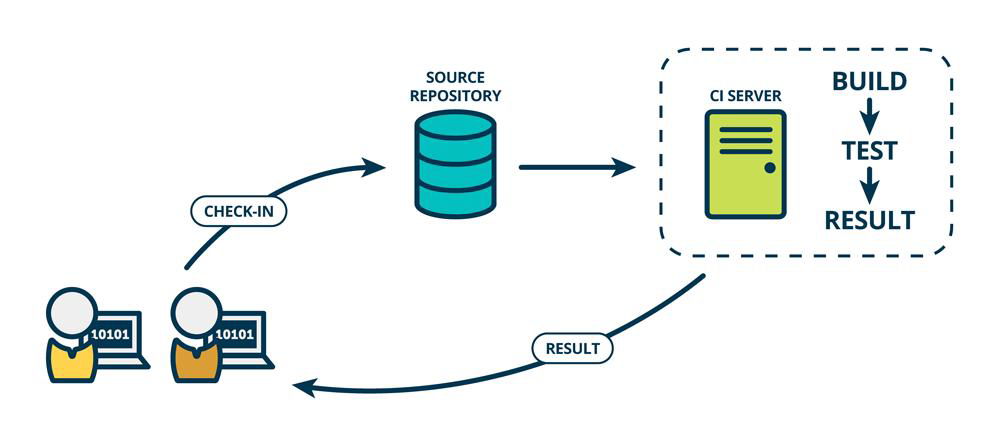

## CI

**Continuous Integration** is a practice where developers frequently integrate their code changes into a **central repository**.

- Developers commit codes to **source repository** (GitHub, GitLab)

- Source repository triggers webhook & notifies **CI Server**

- CI Server pulls codes & perform **build** & (unit) **test** then return the **results** back to developers.

**Tradeoff**

- **Speed** (efficiency up without affecting quality)
  - Duration
  - Error rate
  - Managed service: GitHub Action, GitLab CI
- **Extensibility** (Avoid analysis paralysis)
  - Best practices
- **Security** (preventive/detective)
  - Auditting
  - Observability
  - Supply-chain

### Best Practice

- "Main-branch development practice," with small, frequent code commits.
- Each commit should trigger the pipeline.
- Include building and automated testing (unit).
- Code scan (qualitysecurity risks).
- Coverage
  - **Code checkout, Unit test, Build, Push, Messaging**
  - Static code scan, E2E test, Image scan, Image signature, Configuration/DB Management, Security test
- [Measurement](https://dora.dev/capabilities/continuous-integration/)