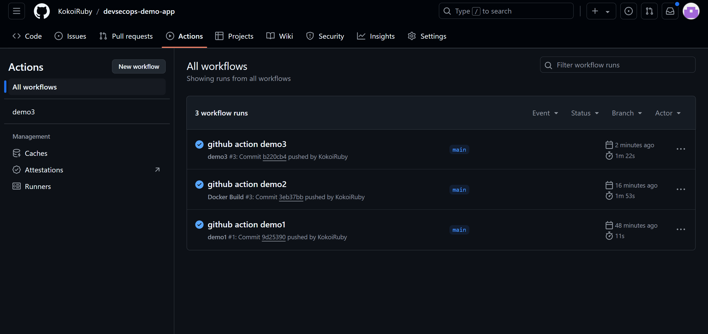

## [GitHub Action](https://docs.github.com/en/actions)

A QEMU-based CI/CD platform that allows you to automate your build, test, and deployment pipeline. :dollar: [Pricing](https://github.com/pricing)

`.github/workflows/*.yaml`

- A **workflow** is a configurable automated process that will run one or more jobs.

- An **event** is a specific activity in a repository that triggers a **workflow** run.

- A **job** is a set of **steps** in a workflow that is executed on the same **runner**.

- An **action** is a custom app that performs a complex but frequently repeated task.

  


### [Marketplace](https://github.com/marketplace?type=actions)

### Hands-on

```bash
# devsecops-demo-app repository
mkdir -p .github/workflows
```

#### Demo#1

Create a workflow yaml that contains only one step to check out code.

```yaml
cat > .github/workflows/demo1.yaml << EOF
name: demo1

on:
  push:
  pull_request:

jobs:
  build:
    runs-on: ubuntu-latest
    steps:
      - name: Checkout
        uses: actions/checkout@v4
      - name: Run script
        run: |
          ls -al
EOF
```

Add, Commit and Push.

```bash
git add .
git commit -m "github action demo1"
git push -u origin main
```

Check on repository.


Remove workflow yaml & prepare for the next demo.

```bash
# rm
rm .github/workflows/demo1.yaml
```

#### Demo#2

Create a workflow yaml that build images on demand.

```yaml
# vi .github/workflows/demo2.yaml
name: demo2

on:
  push:

jobs:
  build:
    runs-on: ubuntu-latest

    env:
      REGISTRY_URL: "harbor.devsecops.yukanyan.us.kg"
      REGISTRY_PROJECT: "devsecops-demo-app"

    steps:
      - name: Checkout
        uses: actions/checkout@v4
        with:
          fetch-depth: 0

      - name: Set up Docker Buildx
        uses: docker/setup-buildx-action@v3

      - name: Insecure Docker Repository
        run: |
          cat /etc/docker/daemon.json
          sudo truncate -s-2 /etc/docker/daemon.json
          echo ", \"insecure-registries\": [\"${{ env.REGISTRY_URL }}\"]}" | sudo tee -a /etc/docker/daemon.json
          sudo systemctl restart docker

      - name: Check changes in directories
        id: dir_changes
        run: |
          for dir in */
          do
            dir=${dir%*/}
            if git diff --quiet HEAD^ HEAD -- ./$dir
            then
              echo "$dir: false" >> changed_dirs.txt
            else
              echo "$dir: true" >> changed_dirs.txt
            fi
          done
          cat changed_dirs.txt

      - name: Build Docker images
        run: |
          echo "${{ secrets.HARBOR_PASSWORD }}" | docker login ${{ env.REGISTRY_URL }} -u ${{ secrets.HARBOR_USERNAME }} --password-stdin
          while IFS= read -r line
          do
            dir=$(echo $line | cut -d ':' -f 1)
            changed=$(echo $line | cut -d ' ' -f 2)
            if [ "$changed" == "true" ] && [ -f "./$dir/Dockerfile" ]
            then
              docker build -t ${{ env.REGISTRY_URL }}/${{ env.REGISTRY_PROJECT }}/$dir:${{ github.sha }} ./$dir
              docker push ${{ env.REGISTRY_URL }}/${{ env.REGISTRY_PROJECT }}/$dir:${{ github.sha }}
            fi
          done < changed_dirs.txt

```

Create env in repository.


Modify source `foo/templates/index.html` & `bar/templates/index.html`.

```html
<div class="version-info">v0.1.7</div>
```

Add, Commit & Push again

```bash
git add .
git commit -m "github action demo2"
git push -u origin main
```

Check on repository & harbor dashboard.


Remove workflow yaml & prepare for the next demo.

```bash
# rm
rm .github/workflows/demo2.yaml
```

#### Demo#3

Create a workflow yaml that build images in matrix.

```yaml
# vi .github/workflows/demo3.yaml
name: demo3

on:
  push:

jobs:
  docker:
    runs-on: ubuntu-latest
    strategy:
      matrix:
        include:
          - image: harbor.devsecops.yukanyan.us.kg/devsecops-demo-app/foo
            path: foo
          - image: harbor.devsecops.yukanyan.us.kg/devsecops-demo-app/bar
            path: bar
    steps:
      - name: Checkout
        uses: actions/checkout@v4

      - name: Insecure Docker Repository
        run: |
          cat /etc/docker/daemon.json
          sudo truncate -s-2 /etc/docker/daemon.json
          echo ", \"insecure-registries\": [\"harbor.devsecops.yukanyan.us.kg\"]}" | sudo tee -a /etc/docker/daemon.json
          sudo systemctl restart docker

      - name: Login to Docker Hub
        uses: docker/login-action@v3
        with:
          registry: harbor.devsecops.yukanyan.us.kg
          username: ${{ secrets.HARBOR_USERNAME }}
          password: ${{ secrets.HARBOR_PASSWORD }}

      - name: Extract metadata for Docker
        id: meta
        uses: docker/metadata-action@v4
        with:
          images: ${{ matrix.image }}

      - name: Build and push
        uses: docker/build-push-action@v4
        with:
          context: ./${{ matrix.path }}
          file: ${{ matrix.path }}/Dockerfile
          push: true
          tags: ${{ matrix.image }}:${{ github.sha }}
```

Modify source `foo/templates/index.html` & `bar/templates/index.html`.

```html
<div class="version-info">v0.1.8</div>
```

Add, Commit & Push again

```bash
git add .
git commit -m "github action demo3"
git push -u origin main
```

Check on repository & harbor dashboard.




Remove workflow yaml & prepare for the next demo.

```bash
# rm
rm .github/workflows/demo3.yaml
```

#### Demo#4

Create a workflow yaml that build images on demand in matrix on-demand.

```yaml
# vi .github/workflows/demo4.yaml
name: demo4

on:
  push:

jobs:
  prepare:
    runs-on: ubuntu-latest

    outputs:
      matrix: ${{ steps.set-matrix.outputs.matrix }}

    steps:
      - name: Checkout
        uses: actions/checkout@v4
        with:
          fetch-depth: 0

      - name: Set up matrix
        id: set-matrix
        run: |
          changed_dirs=()
          for dir in */
          do
            dir=${dir%*/}
            if ! git diff --quiet HEAD^ HEAD -- ./$dir
            then
              changed_dirs+=($dir)
            fi
          done
          # output json
          json_output="{\"path\":["
          for (( i=0; i<${#changed_dirs[@]}; i++ ));
          do
              json_output+="{\"name\":\"${changed_dirs[$i]}\"}"
              if (( i < ${#changed_dirs[@]}-1 )); then
                  json_output+=","
              fi
          done
          json_output+="]}"
          echo "::set-output name=matrix::${json_output}"

  build:
    needs: prepare
    runs-on: ubuntu-latest

    strategy:
      matrix:
        path: ${{fromJson(needs.prepare.outputs.matrix).path}}

    env:
      REGISTRY_URL: "harbor.devsecops.yukanyan.us.kg"
      REGISTRY_PROJECT: "devsecops-demo-app"

    steps:
      - name: Checkout
        uses: actions/checkout@v4
        with:
          fetch-depth: 0

      - name: Insecure Docker Repository
        run: |
          cat /etc/docker/daemon.json
          sudo truncate -s-2 /etc/docker/daemon.json
          echo ", \"insecure-registries\": [\"harbor.devsecops.yukanyan.us.kg\"]}" | sudo tee -a /etc/docker/daemon.json
          sudo systemctl restart docker

      - name: Set up Docker Buildx
        uses: docker/setup-buildx-action@v3

      - name: Build Docker images
        run: |
          if [ -f "./${{ matrix.path.name }}/Dockerfile" ]
          then
            echo "${{ secrets.HARBOR_PASSWORD }}" | docker login ${{ env.REGISTRY_URL }} -u ${{ secrets.HARBOR_USERNAME }} --password-stdin
            docker build -t ${{ env.REGISTRY_URL }}/${{ env.REGISTRY_PROJECT }}/${{ matrix.path.name }}:${{ github.sha }} ./${{ matrix.path.name }}
            docker push ${{ env.REGISTRY_URL }}/${{ env.REGISTRY_PROJECT }}/${{ matrix.path.name }}:${{ github.sha }}
          fi
```

Modify source `foo/templates/index.html` & `bar/templates/index.html`.

```html
<div class="version-info">v0.1.9</div>
```

Add, Commit & Push again

```bash
git add .
git commit -m "github action demo4"
git push -u origin main
```

Check on repository & harbor dashboard.


In the end, rollback & prepare for the next demo.

```bash
# rollback
git reset --hard <recorded_commit_hash>
git push --force
```

