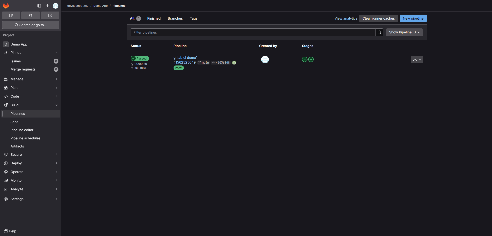
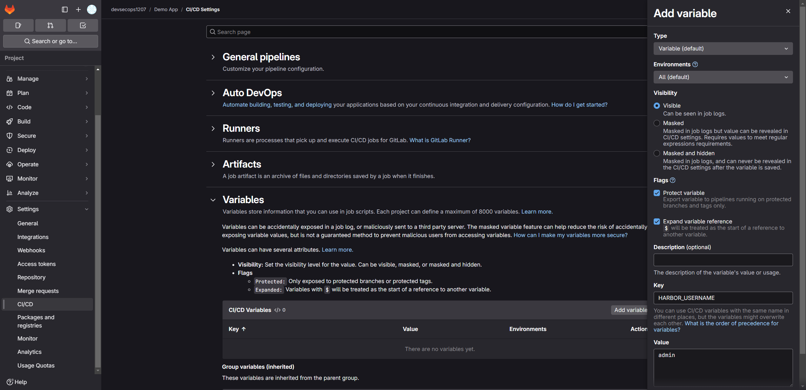
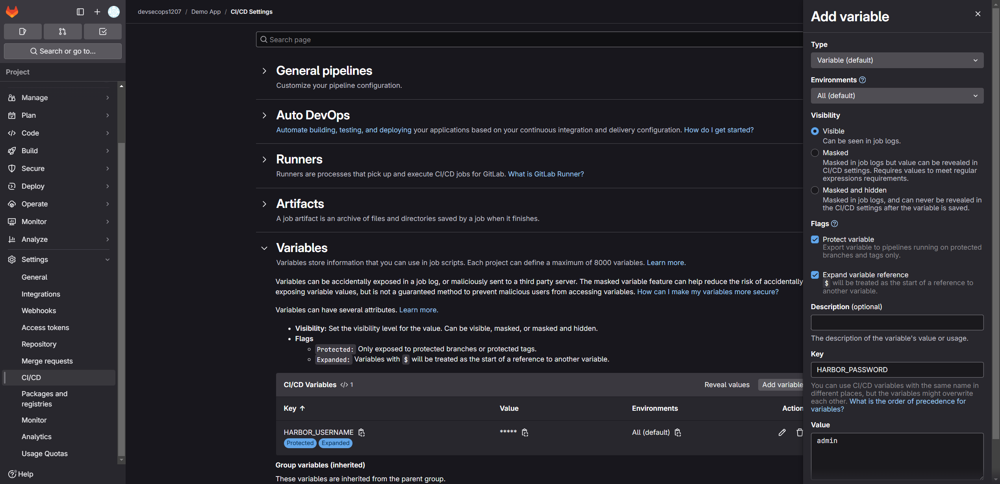
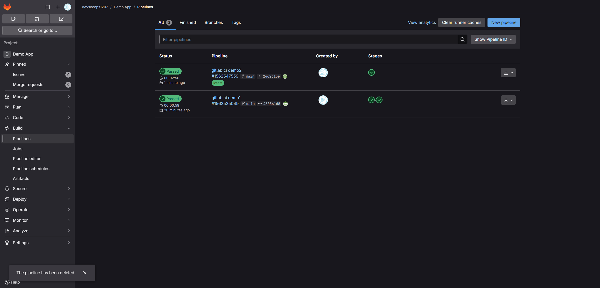
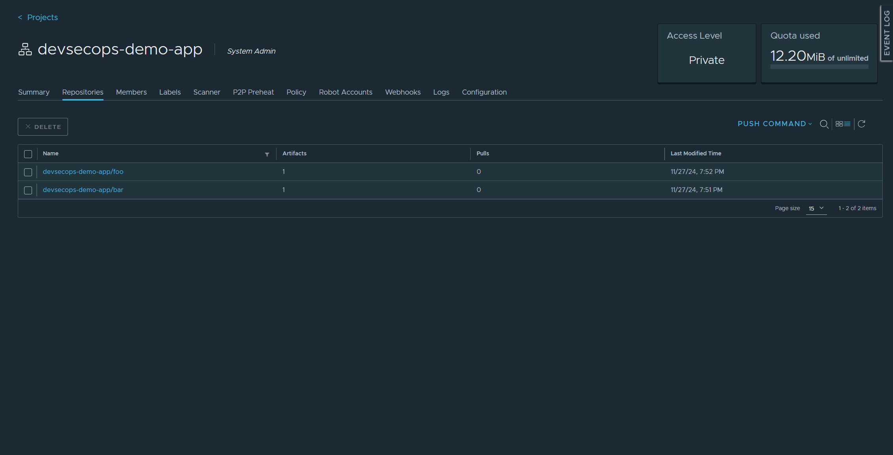
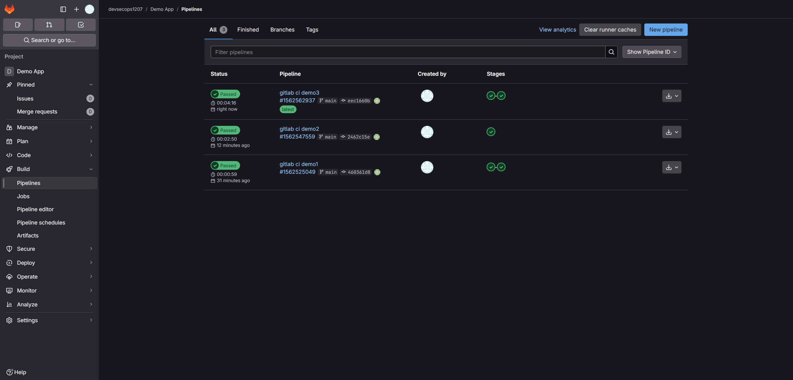
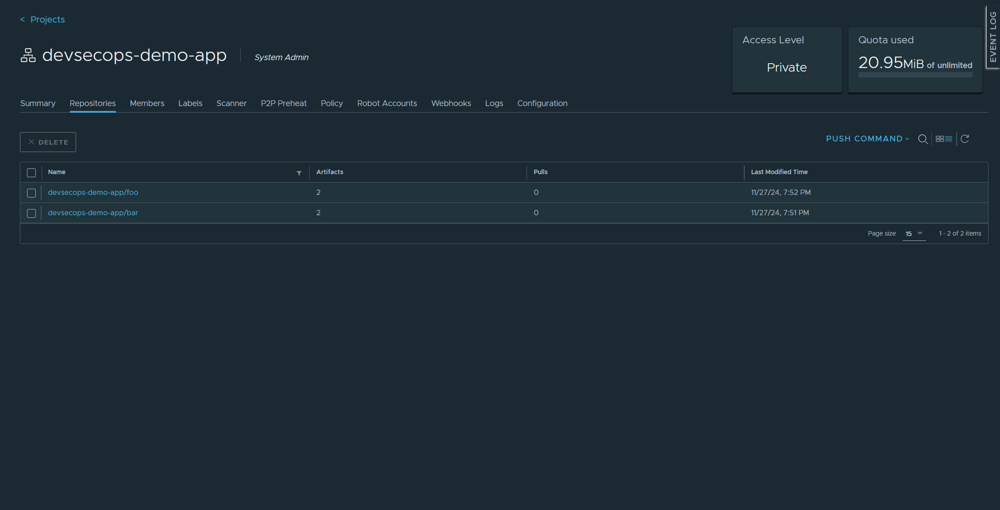
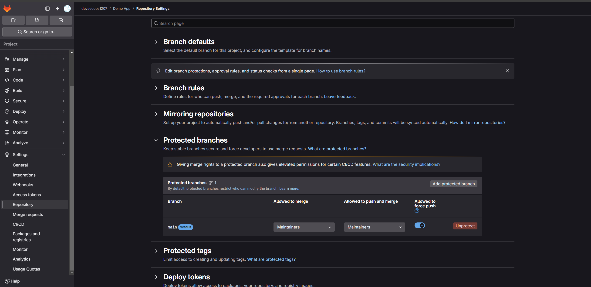

## [GitLab CI](https://docs.gitlab.com/ee/ci/)

GitLab CI/CD helps ensure that the code deployed to production complies with your established code standards.

[`.gitlab-ci.yml`](https://docs.gitlab.com/ee/ci/yaml/index.html)

- **stage**: Use `stage` to define which [stage](https://docs.gitlab.com/ee/ci/yaml/index.html#stages) a job runs in.

- **image**: Use `image` to specify a Docker image that the **job** runs in.

- **variables**: Use `variables` to define [CI/CD variables](https://docs.gitlab.com/ee/ci/variables/index.html#define-a-cicd-variable-in-the-gitlab-ciyml-file) for jobs.

- **services**: Use `services` to specify any additional Docker images that your **scripts** require to run successfully.

- **before_script**: Use `before_script` to define an array of commands that should run before each job’s `script` commands.


### [Build Docker images](https://docs.gitlab.com/ee/ci/docker/using_docker_build.html)

**DinD**: "Docker-in-Docker"

### Hands-on

> Note: if you are in mainland China, u need to verify your account via foreign phone number or credit card.

```bash
# devsecops-demo-app-gitlab repository
mkdir -p .gitlab
```

#### Demo#1

Create a "Hello world!".

```yaml
# vi .gitlab-ci
stages:
  - build-stage
  - test-stage

build:
  stage: build-stage
  script:
    - echo "build stage"

test:
  stage: test-stage
  script:
    - echo "test stage"
```

Add, Commit & Push again

```bash
git add .
git commit -m "gitlab ci demo1"
git push -u origin main
```

Check on repository.



Clean pipeline yaml & prepare for the next demo.

```bash
# rm
cat /dev/null > .gitlab-ci
```

#### Demo#2

```yaml
# vi .gitlab-ci
# pipeline image
image: docker:latest

variables:
  REGISTRY_URL: "harbor.devsecops.yukanyan.us.kg"
  REGISTRY_PROJECT: "devsecops-demo-app"

# sidecar
services:
  - name: docker:dind
    # http
    command:
      [
        '--insecure-registry=harbor.devsecops.yukanyan.us.kg',
      ]

stages:
  - build

# install git & ssh before job run
before_script:
  - apk add --no-cache git
  - "which ssh-agent || ( apk update -y && apk add openssh-client git -y )"
  - eval $(ssh-agent -s)
  - echo "$HARBOR_PASSWORD" | docker login $REGISTRY_URL -u $HARBOR_USERNAME --password-stdin

build:
  stage: build
  script:
    - |
      for dir in */
      do
        dir=${dir%*/}
        if git diff --quiet HEAD^ HEAD -- ./$dir
        then
          echo "$dir: false" >> changed_dirs.txt
        else
          echo "$dir: true" >> changed_dirs.txt
        fi
      done
      cat changed_dirs.txt
    - |
      while IFS= read -r line
      do
        dir=$(echo $line | cut -d ':' -f 1)
        changed=$(echo $line | cut -d ' ' -f 2)
        if [ "$changed" == "true" ] && [ -f "./$dir/Dockerfile" ]
        then
          docker build -t $REGISTRY_URL/$REGISTRY_PROJECT/$dir:${CI_COMMIT_SHA} ./$dir
          docker push $REGISTRY_URL/$REGISTRY_PROJECT/$dir:${CI_COMMIT_SHA}
        fi
      done < changed_dirs.txt
```

Create env on GitLab Dashboard.





Modify source `foo/templates/index.html` & `bar/templates/index.html`.

```html
<div class="version-info">v0.1.2</div>
```

Add, Commit & Push again

```bash
git add .
git commit -m "gitlab ci demo2"
git push -u origin main
```

Check on repository & harbor dashboard.





Clean pipeline yaml & prepare for the next demo.

```bash
# rm
cat /dev/null > .gitlab-ci
```

#### Demo#3

```yaml
# vi .gitlab-ci
stages:
  - prepare
  - build

variables:
  REGISTRY_URL: "harbor.devsecops.yukanyan.us.kg"
  REGISTRY_PROJECT: "devsecops-demo-app"

prepare:
  stage: prepare
  image: alpine:latest
  before_script:
    - apk add --update git bash
  script:
    - |
      echo '
      changed_dirs=()
      for dir in */
      do
        dir=${dir%*/}
        if ! git diff --quiet HEAD^ HEAD -- "./$dir"
        then
          changed_dirs+=("$dir")
        fi
      done
      json_output="{\"path\":["
      for (( i=0; i<${#changed_dirs[@]}; i++ ));
      do
          json_output+="{\"name\":\"${changed_dirs[$i]}\"}"
          if (( i < ${#changed_dirs[@]}-1 )); then
              json_output+=","
          fi
      done
      json_output+="]}"
      echo $json_output > changed_dirs.json
      ' > /tmp/script.sh
    - chmod +x /tmp/script.sh
    - bash /tmp/script.sh
  # the sharable
  artifacts:
    paths:
      - changed_dirs.json

build:
  stage: build
  image: docker:latest
  services:
    - name: docker:dind
      # http
      command:
        [
          '--insecure-registry=harbor.devsecops.yukanyan.us.kg',
        ]
  script:
    - |
      apk add --no-cache jq
      changed_dirs=$(jq -r '.path[].name' changed_dirs.json)
      for dir in $changed_dirs
      do
        if [ -f "./${dir}/Dockerfile" ]
        then
          echo "${HARBOR_PASSWORD}" | docker login $REGISTRY_URL -u $HARBOR_USERNAME --password-stdin
          docker build -t $REGISTRY_URL/$REGISTRY_PROJECT/$dir:${CI_COMMIT_SHA} ./$dir
          docker push $REGISTRY_URL/$REGISTRY_PROJECT/$dir:${CI_COMMIT_SHA}
        fi
      done
  dependencies:
    - prepare

```

Modify source `foo/templates/index.html` & `bar/templates/index.html`.

```html
<div class="version-info">v0.1.3</div>
```

Add, Commit & Push again

```bash
git add .
git commit -m "gitlab ci demo3"
git push -u origin main
```

Check on repository & harbor dashboard.





Note: you need to enable "Allowed to force push" in repository setting.



In the end, rollback & prepare for the next demo.

```bash
# rollback
git reset --hard <recorded_commit_hash>
git push --force
```

