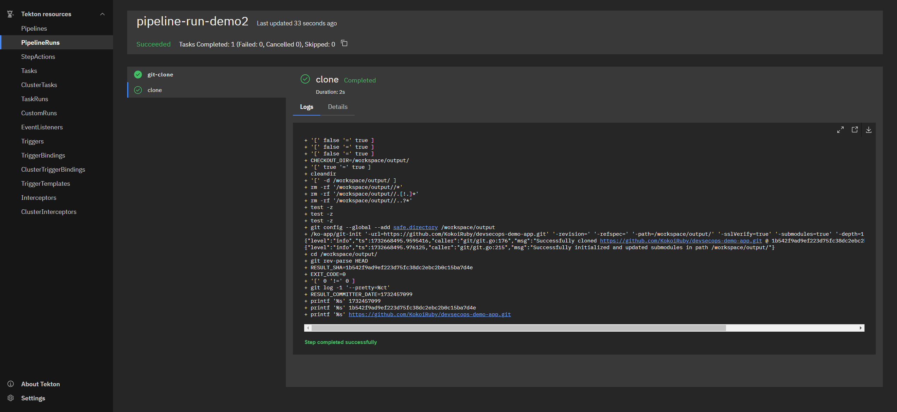

## [Tekton](https://tekton.dev/docs/)

Tekton is a **cloud-native** solution for building CI/CD pipelines.

It installs and runs as an **extension** on a Kubernetes cluster and comprises a set of Kubernetes **Custom Resources** that define the building blocks you can create and reuse for your pipelines.

### [Concept model](https://tekton.dev/docs/concepts/concept-model/)

A **step** is an operation in a CI/CD workflow, such as build/test/push. Tekton performs each step with a **container** image you provide.

A **task** <u>(reusable)</u> is a collection of **steps** in order in the form of a **pod** where each step becomes a running container.

A **pipeline** is a collection of **tasks** in order. Tekton collects all the tasks, connects them in a **directed acyclic graph (DAG)**.

A **workspace** (PVC) allows allow task(s) within a Tekton pipeline to share ccontext.


A **pipelineRun** is a specific execution of a **pipeline** given inputs.

A **taskRun** is a specific execution of a **task** given inputs.


### [Triggers](https://tekton.dev/docs/triggers/)

A Tekton component that allows you to detect and extract information from events from a variety of sources and deterministically instantiate and execute [`TaskRuns`](https://github.com/tektoncd/pipeline/blob/master/docs/taskruns.md) and [`PipelineRuns`](https://github.com/tektoncd/pipeline/blob/master/docs/pipelineruns.md) based on that information.

- [`EventListener`](https://tekton.dev/docs/triggers/eventlisteners/) - listens for events (like GitHub webhook) at a specified port on your Kubernetes cluster.

- [`Trigger`](https://tekton.dev/docs/triggers/triggers/) - specifies what happens when the `EventListener` detects an event.

- [`TriggerTemplate`](https://tekton.dev/docs/triggers/triggertemplates/) - specifies a blueprint for the resource that u want to instantiate when `EventListener` detects an event.

- [`TriggerBinding`](https://tekton.dev/docs/triggers/triggerbindings/) - specifies the fields in the event payload from which you want to extract data and the fields in your corresponding `TriggerTemplate` to populate with the extracted values.

  


### [TektonHub](https://hub.tekton.dev/)

### Hands-on

> Note: running TaskRuns and PipelineRuns in the "tekton-pipelines" namespace is [discouraged](https://github.com/tektoncd/pipeline/blob/main/docs/additional-configs.md#running-taskruns-and-pipelineruns-with-restricted-pod-security-standards).

> Dashboard: http://tekton.prefix.domain

```bash
cd tutorial/ci/tekton
export KUBECONFIG=../../../iac/config.yaml
```

#### Demo#1


Create tasks: [git-clone](https://hub.tekton.dev/tekton/task/git-clone) 👉 [sonarqube-scanner](https://hub.tekton.dev/tekton/task/sonarqube-scanner) 👉 [kaniko](https://hub.tekton.dev/tekton/task/kaniko).

```bash
kubectl apply -f "manifest/demo1/task-*"
```

Create a taskrun includes git-clone task only.

```bash
kubectl apply -f manifest/demo1/taskrun.yaml 
```

Check on Dashboard.


#### Demo#2


Create sonarqube user token on Sonarqube Dashboard (see more in Jenkins tutorial).


Populate token & create user token secret.

```bash
kubectl apply -f manifest/demo2/serviceaccount-sonar-user.yaml
kubectl apply -f manifest/demo2/secret-sonar-user.yaml
```

Create pvc for workspace.

```bash
kubectl apply -f manifest/demo2/pvc-pipeline.yaml
```

Create a pipeline includes git-clone task only.

```bash
kubectl apply -f manifest/demo2/pipeline.yaml
```

Create a pipeline-run to trigger the pipeline.

```bash
kubectl apply -f manifest/demo2/pipeline-run.yaml
```



#### Demo#3


Create a pipeline includes git-clone & kaniko build task.

```bash
kubectl apply -f manifest/demo3/pipeline.yaml
```

Create a pipeline-run to trigger the pipeline.

```bash
kubectl apply -f manifest/demo3/pipeline-run.yaml
```


#### Demo#4


Create a pipeline includes git-clone, sonarqube-scanner, and kaniko build task.

```bash
kubectl apply -f manifest/demo4/pipeline.yaml
```

Create a pipeline-run to trigger the pipeline.

```bash
kubectl apply -f manifest/demo4/pipeline-run.yaml
```


#### Demo#5


Create a pipeline that **<u>merge</u>** git-clone, sonarqube-scanner, and kaniko build task.

```bash
kubectl apply -f manifest/demo5/pipeline.yaml
```

Create a pipeline-run to trigger the pipeline.

```bash
kubectl apply -f manifest/demo5/pipeline-run.yaml
```


#### Demo#6


Create serviceaccount & RBAC.

```bash
kubectl apply -f manifest/demo6/serviceaccount-trigger.yaml
```

Create EventListener & TriggerTemplate.

```bash
kubectl apply -f manifest/demo6/eventlistener-github.yaml
kubectl apply -f manifest/demo6/triggertemplate-github.yaml
```


Add tekton webhook in GitHub repository.


Modify source `foo/templates/index.html` & `bar/templates/index.html`.

```bash
<div class="version-info">v0.1.6</div>
```

Add, Commit & Push.

```bash
git add .
git commit -m "tekton demo6"
git push -u origin main
```

In the end, rollback & prepare for the next demo.

```bash
# rollback
git reset --hard <recorded_commit_hash>
git push --force
```

Check tekton dashboard.


