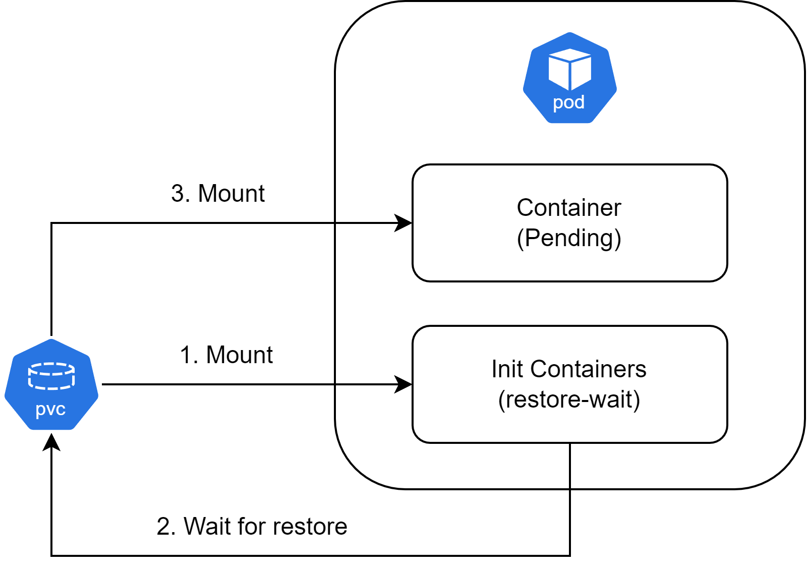

## [Velero](https://velero.io/)

An open source tool to

- safely backup and restore
- perform disaster recovery
- migrate Kubernetes cluster resources (manifests in etcd) and persistent volumes.

vs.

- K8s: etcd (etcdctl snapshot save) & pv (to external storage)
- Velero: cluster-level backup & on-demand recovery, cluster migration, replication/mirroring.

### Architecture

1. The Velero client makes a call to the Kubernetes API server to create a `Backup` object.
2. The `BackupController` notices the new `Backup` object and performs validation.
3. The `BackupController` begins the backup process. It collects the data by querying the API server for resources.
4. The `BackupController` makes a call to the object storage service – for example, AWS S3 – to upload the backup file.


### Backup

- Snapshot
  - Strong consistency
  - Requirements on cloud provider & storage providers.
- [Restic](https://restic.net/)/[Kopia](https://kopia.io/)
  - Backup hooks to achieve strong consistency
  - Does not support [hostPath](https://kubernetes.io/docs/concepts/storage/volumes/#hostpath), but [local](https://kubernetes.io/docs/concepts/storage/storage-classes/#local).

#### [Schedule](https://velero.io/docs/v1.9/backup-reference/#schedule-a-backup)

```bash
velero schedule create example-schedule --schedule="0 3 * * *"
# trigger 
velero backup create --from-schedule example-schedule
```

#### [Hooks](https://velero.io/docs/v1.3.2/hooks/)

Lifecycle commands.

UC: freeze io to secure consistency.

### Restore

1. Inject init container into pod for restore while app container is still in pending.
2. Init container populate data into pv
3. PV mount to app container via PVC.



### [Migration](https://velero.io/docs/main/migration-case/)

Requirements:

- The Kubernetes version of the restore cluster >= backup cluster
- The backup/restore cluster need to be configured with the same object storage.
- File system backup needs to be enabled `--defaultvolumes-to-fs-backup=true`.

### Hands-on

#### Demo#1

> Install

Install velero [cli](https://velero.io/docs/v1.3.0/basic-install/#install-the-cli).

Install velero in cluster.

```bash
export KUBECONFIG=config.yaml
# endpoint: https://cos.ap-hongkong.myqcloud.com
# it does not include bucket name level
velero install \
	--provider aws
	--plugins/velero-plugin-for-aws:v1.2.1 \
	--use-node-agent \
	--default-volumes-to-fs-backup=true \
	--secret-file ./credentials-velero \
	--user-volume-snapshots=false \
	--bucket <name> \
	--backup-location-config region=<region>,s3ForcePathStyle="true",s3Url=<endpoint>
```

Wait until cos is ready

```bash
velero backup-location get
```

#### Demo#2

> Backup & Restore

Deploy demo app.

```bash
kubectl apply -f manifest/deployment-nginx-with-pv.yaml
```

Access & check logs.

```bash
curl http://<ip>:30080
kubectl exec -it $(kubectl get pods -l app=nginx -o jsonpath='{.items[0].metadata.name}' -n nginx) -n nginx -- cat /var/log/nginx/access.log
```

Backup.

```bash
velero backup create my-cluster \
	--default-volumes-to-fs-backup=true \
	--include-namespaces=nginx
```

Check.

```bash
kubectl get Backup
kubectl get PodVolumeBackup
velero backup describe my-cluster
```

Delete demo app inlcuding pv.

```bash
kubectl delete ns nginx
```

Restore.

```bash
velero restore create --from-backup my-cluster
```

Check.

```bash
velero restore describe ${name}
kubectl get pods -n nginx
kubectl exec -it $(kubectl get pods -l app=nginx -o jsonpath='{.items[0].metadata.name}' -n nginx) -n nginx -- cat /var/log/nginx/access.log
```

#### Demo#3

> Cluster migration

Create demo app.

```bash
kubectl apply -f manifest/deployment-nginx-with-pv.yaml
```

Create backup.

```bash
export KUBECONFIG=config.yaml
velero backup create my-cluster-all --default-volumes-to-fs-backup=true
```

Create a new cluster & install velero. Note: sharing the same object storage.

```bash
export KUBECONFIG=config.yaml
# endpoint: https://cos.ap-hongkong.myqcloud.com
# it does not include bucket name level
velero install \
	--provider aws
	--plugins/velero-plugin-for-aws:v1.2.1 \
	--use-node-agent \
	--default-volumes-to-fs-backup=true \
	--secret-file ./credentials-velero \
	--user-volume-snapshots=false \
	--bucket <name> \
	--backup-location-config region=<region>,s3ForcePathStyle="true",s3Url=<endpoint>
```

Check backup in restore cluster.

```bash
velero backup describe my-cluster-all
```

Restore.

```bash
velero restore create --from-backup my-cluster-all
```

Check.

```bash
velero restore describe ${name}
kubectl get pods -n nginx
kubectl exec -it $(kubectl get pods -l app=nginx -o jsonpath='{.items[0].metadata.name}' -n nginx) -n nginx -- cat /var/log/nginx/access.log
```

