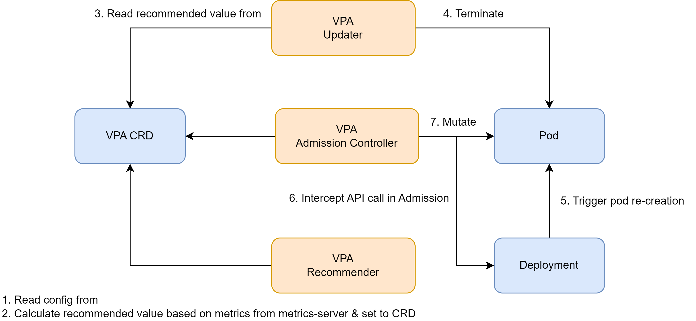

## [VPA](https://github.com/kubernetes/autoscaler/tree/master/vertical-pod-autoscaler)

It adjusts/resizes the pod resources **in-place** = no downtime given [policy](https://kubernetes.io/docs/tasks/configure-pod-container/resize-container-resources/#container-resize-policies).

UC:

- Cloud-based dev env: compile code in the cloud and dynamically adjust Pod resource quotas to prevent OOM.
- Meeting the high CPU and memory requirements of the Java process during startup.



:cry: [VPA does not support in-place update](https://github.com/kubernetes/autoscaler/issues/4016) as updater will kill the pod & rely on admission controller to mutate.

### [QoS](https://kubernetes.io/docs/concepts/workloads/pods/pod-qos/)

A Kubernetes concept that the scheduler uses for **deciding the scheduling and eviction priority** of the pods.


### [PriorityClass](https://kubernetes.io/docs/concepts/scheduling-eviction/pod-priority-preemption/#priorityclass)

It defines a mapping from a priority class name to the integer value of the prio. Higher value, Higher prio.

It measures the "importance" of a pod.

When cluster resources are insufficient, Pods with a higher PriorityClass will be scheduled first.

### [Autoscaler](https://github.com/kubernetes/autoscaler)

A component used to automatically adjust the computing resources of a cluster (node elastic scaler).

- When Pods in the cluster cannot be scheduled due to insufficient resources, triggering node scaling.
- When there are nodes in the cluster with low long-term resource usage, triggering node scaling down.

**It relies on the implementation by the [cloud provider](https://github.com/kubernetes/autoscaler/tree/master/cluster-autoscaler).**

### Hands-on

#### Demo#1

> In-place resizing

Apply demo pod.

```bash
kubectl apply -f ../../vpa/manifest/demo1/pod-in-place.yaml
```

Modify requests & limits cpu to 150m. Notice that pod will not restart.

```bash
kubectl edit pod in-place
```

Modify requests & limits mem to 150Mi. Now pod will restart.

```bash
kubectl edit pod in-place
```

#### Demo#2

> VPA

[Install](https://github.com/kubernetes/autoscaler/blob/master/vertical-pod-autoscaler/docs/installation.md) vpa.

Deploy vpa & demo app.

```bash
kubectl apply -f ../../vpa/manifest/demo2/hamster.yaml
```

Check.

```bash
kubectl get vpa
```

Check pod requests & limists cpu & mem.

```bash
kubectl get po -l app=hamster | grep -A 3 "resources"
```


