## [Jira](https://www.atlassian.com/software/jira)

A project management and issue tracking tool developed by Atlassian.

It is widely used by software development for tracking bugs, managing projects, and facilitating agile development methodologies.

### Trunk-based vs. GitFlow

### Hands-on

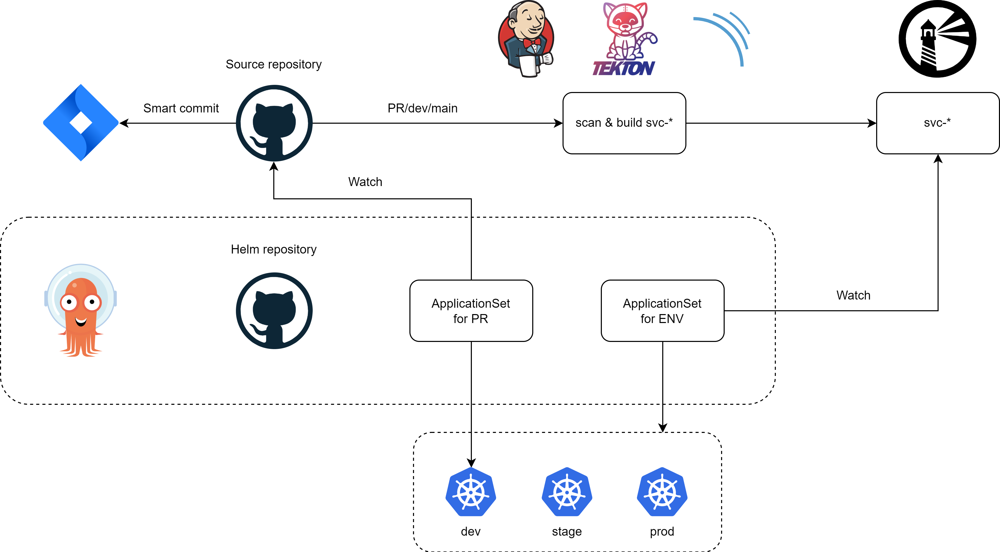

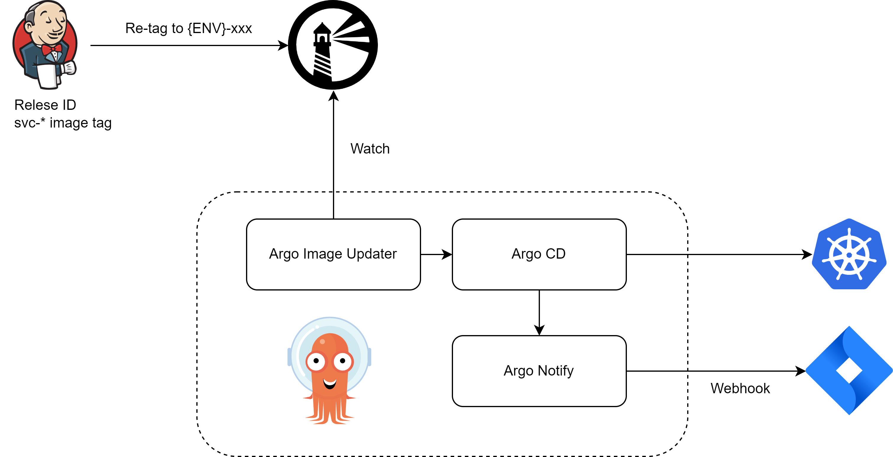


#### Demo#1

> Smart commit

Note: you might meet 504 Gateway Time-out. Please check jira-0 pod log & refresh the page later if necessary.

Set up application properties on jira dashboard.

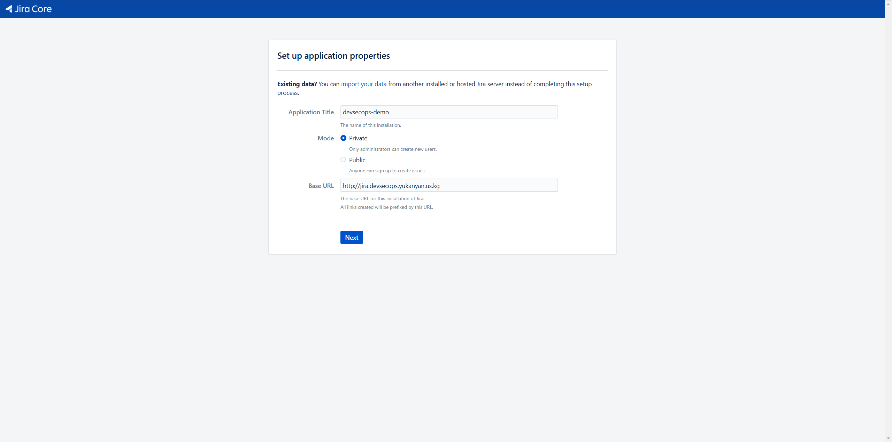

Generate trail license. Note: you need a Atlanssian account.

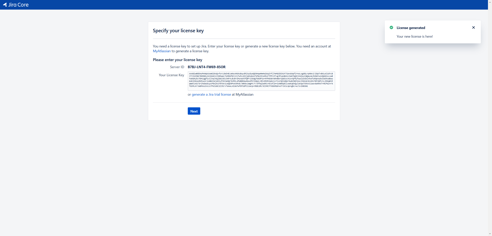

Set up admin account. **Note: you need to use the same email as the one in Github that contains demo app source repo.**

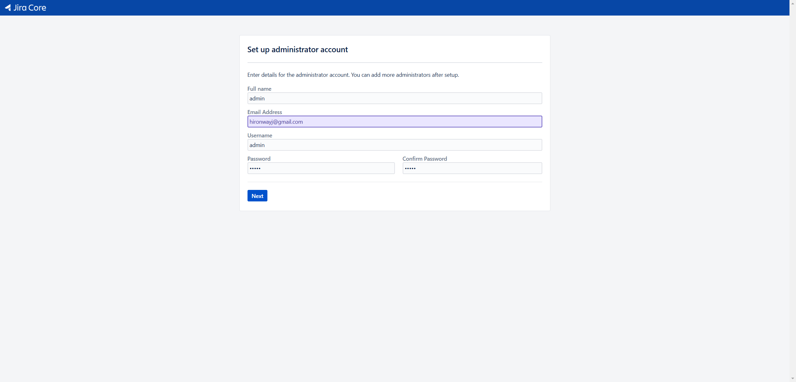

Good to go.

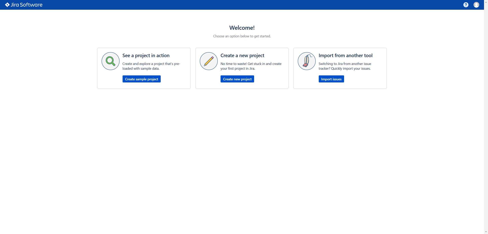

Create a scrum project & specify the key.

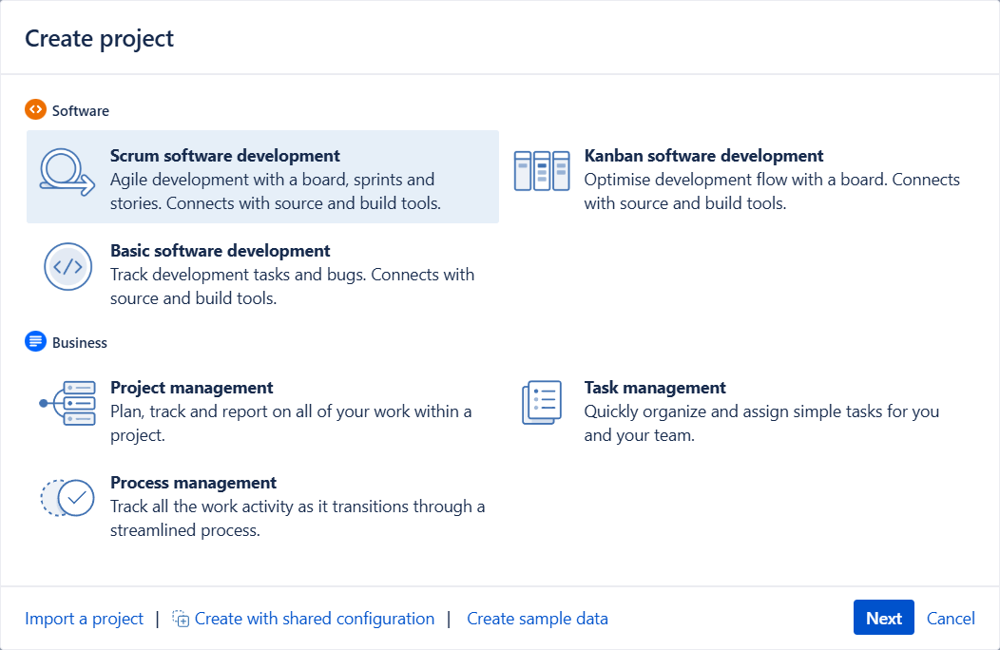

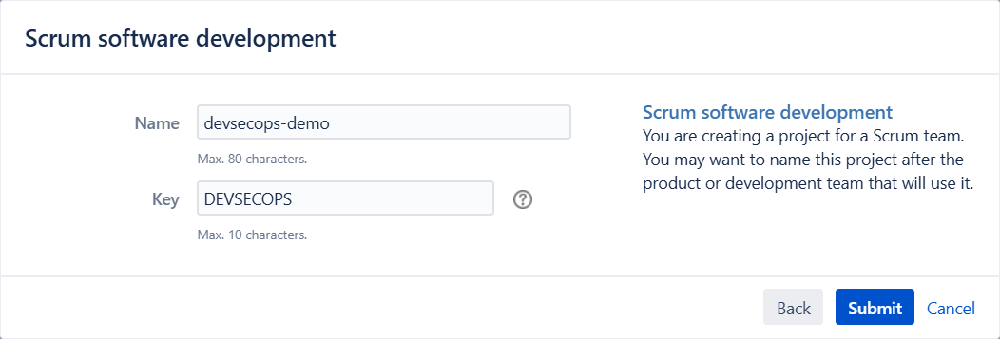

"Manage apps".

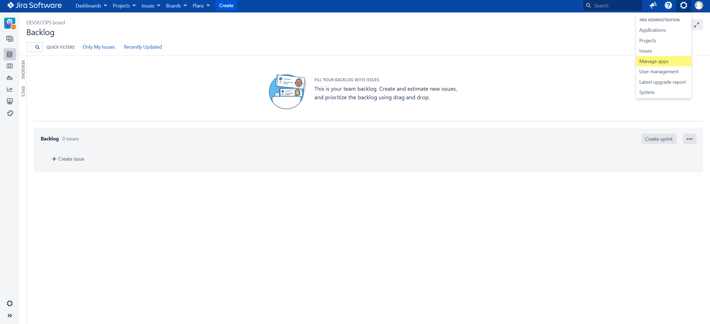

"Applications" 👉 "DVCS accounts".

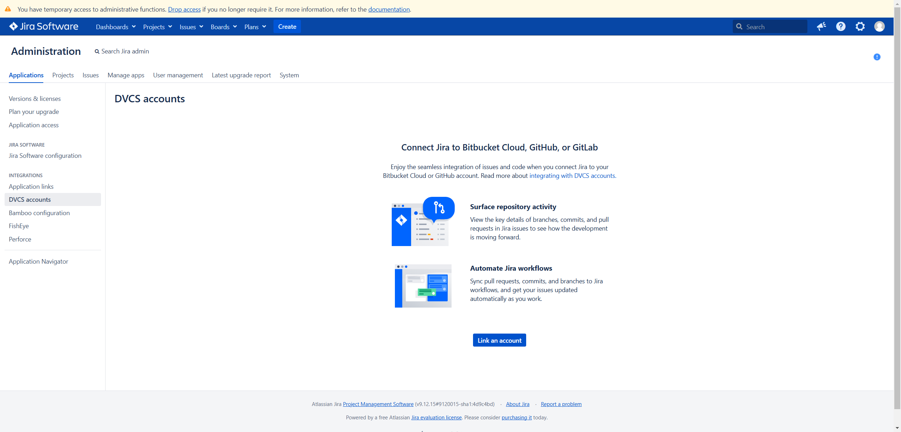

Create client id & secret in GitHub and add to jira.


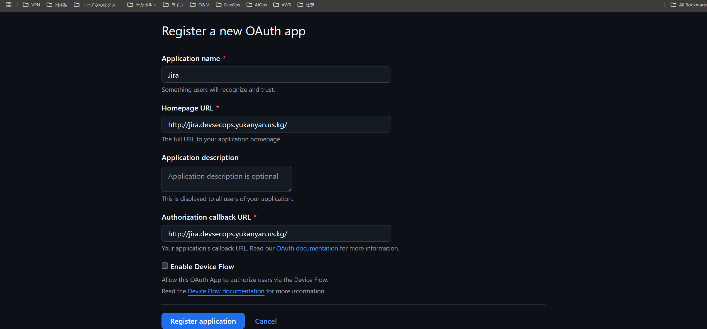

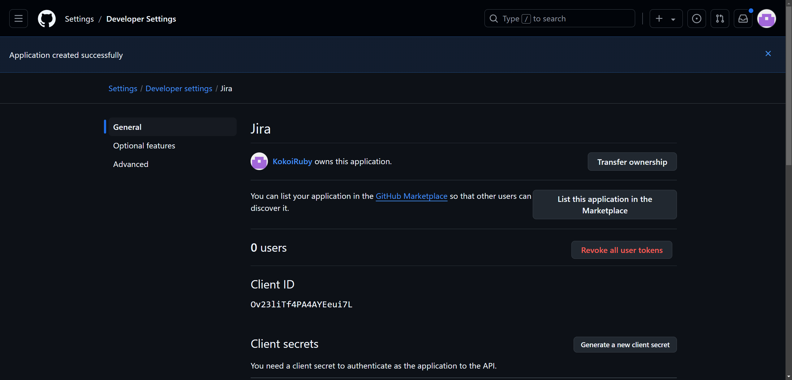

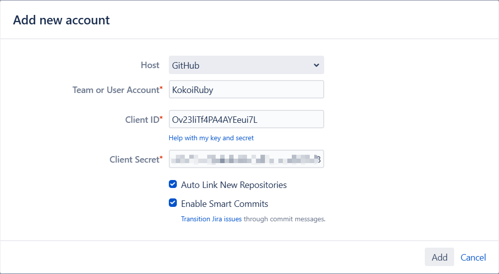

Authorize.

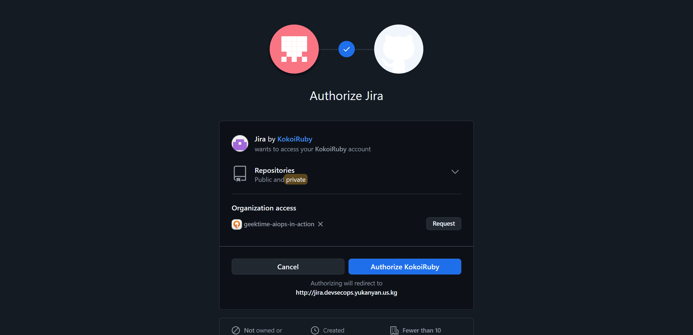

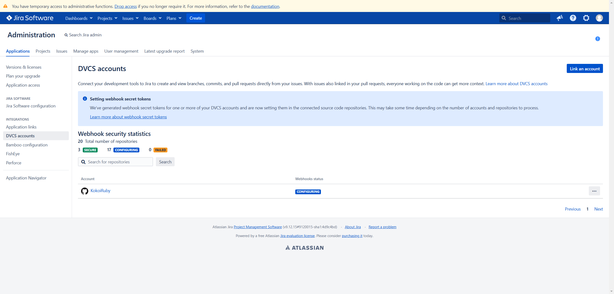

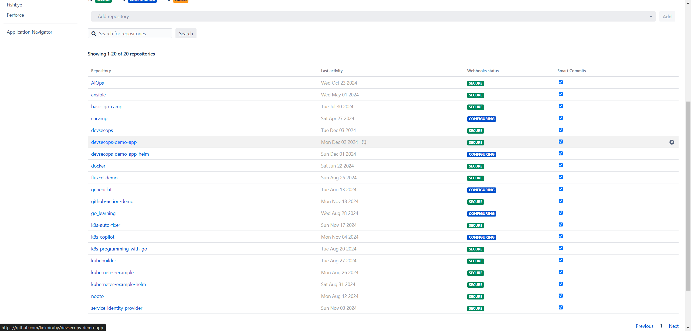

Create a test issue.

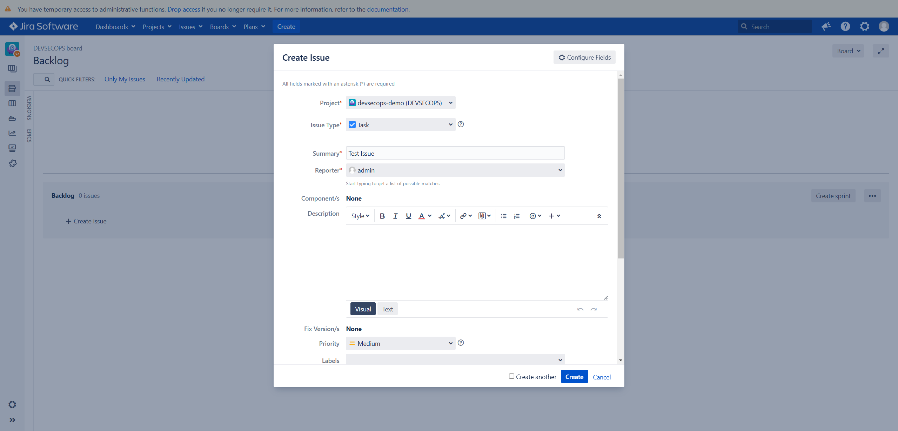

Check created issue. Note: the ticket number is what we want to correlate with commit.

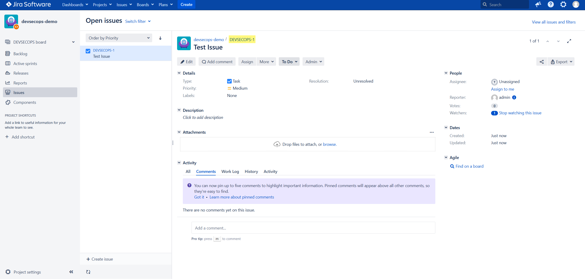

Create a commit in demo app source repo given ticket number.

```bash
git commit -a -m 'DEVSECOPS-1 #comment test1' --allow-empty
git push -u origin main
```

Check on jira dashboard.

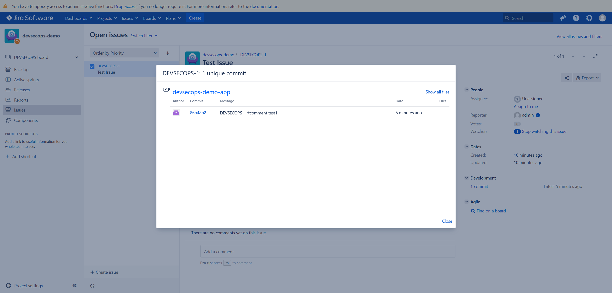

Similarly.

```bash
# log time spent on the issue.
git commit -a -m 'DEVSECOPS-1 #time 2h' --allow-empty
git push -u origin main
```

```bash
# transition the issue to the "In Progress" status.
git commit -a -m 'DEVSECOPS-1 #in-progress' --allow-empty
git push -u origin main
```

```bash
# transition the issue to the "Done" status.
git commit -a -m 'DEVSECOPS-1 #done' --allow-empty
```

#### Demo#2

> Jenkins multibranch