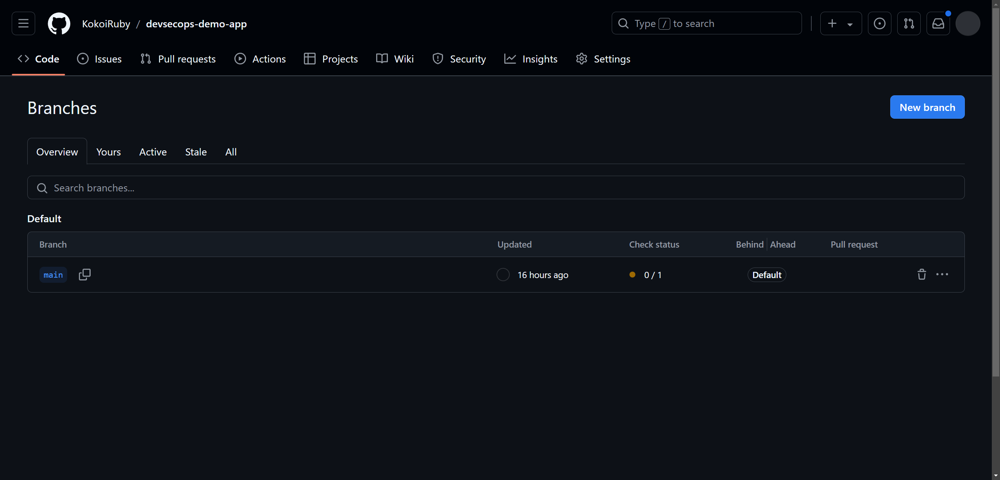

## [Jira](https://www.atlassian.com/software/jira)

A project management and issue tracking tool developed by Atlassian.

It is widely used by software development for tracking bugs, managing projects, and facilitating agile development methodologies.

### Trunk-based Development vs. GitFlow

**Trunk-based Development** (Quality < Efficiency) 👉 ApplicationSet + PR Generator

:smile:

- At the beginning of the project, team wants to deliver the MVP as soon as possible.

- Rapid iteration: sprinting towards delivery.

- Small team & most members are senior developers: trust and autonomy.

  


**Gitflow** (Quality > Efficiency) 👉 ApplicationSet  + List Generator

:smile:

- Open source.
- Large team & Most members are junior developers.
- Stable product & large team, need stric code reviews.


### Hands-on


#### Demo#1

> Smart commit

Note: you might meet 504 Gateway Time-out. Please check jira-0 pod log & refresh the page later if necessary.

Set up application properties on jira dashboard.


Generate trail license. Note: you need a Atlanssian account.


Set up admin account. **Note: you need to use the same email as the one in Github that contains demo app source repo.**


Good to go.


Create a scrum project & specify the key.


"Manage apps".


"Applications" 👉 "DVCS accounts".


Create client id & secret in GitHub and add to jira.


Authorize.


Create a test issue.


Check created issue. Note: the ticket number is what we want to correlate with commit.


Create a commit in demo app source repo given ticket number.

```bash
git commit -a -m 'DEVSECOPS-1 #comment test1' --allow-empty
git push -u origin main
```

Check on jira dashboard.


Similarly.

```bash
# log time spent on the issue.
git commit -a -m 'DEVSECOPS-1 #time 2h' --allow-empty
git push -u origin main
```

```bash
# transition the issue to the "In Progress" status.
git commit -a -m 'DEVSECOPS-1 #in-progress' --allow-empty
git push -u origin main
```

```bash
# transition the issue to the "Done" status.
git commit -a -m 'DEVSECOPS-1 #done' --allow-empty
```

#### Demo#2

> Jenkins parallel build

Create a multibranch pipeline.


Setup sonarqube in jenkins dashboard.


Create sonar token. 


Populate token & create secret.

```bash
export KUBECONFIG=./config.yaml
kubectl apply -f helm_sonarqube/secret-sonar-token.yaml
```

Copy `Jenkinsfile-demo2` to demo app source repo.


Add, Commit & Push

```bash
git add .
git commit -m "jira jenkins demo2"
git push -u origin main
```

Check on jenkins dashboard.


Check on harbor dashboard.


#### Demo#3

> PR env http://demo-app.ns.project.domain in PR commit

> **Please switch to the [twin](https://github.com/KokoiRuby/devsecops-demo-app-helm-argocd-pr) helm repo in order to proceed with the following demo.**

Copy values.yaml to demo app helm repo.


Add, Commit & Push

```bash
git add .
git commit -m "jira argocd demo3"
git push -u origin main
```

Apply application set.

```bash
export KUBECONFIG=../../iac/config.yaml
kubectl apply -f argocd/manifest/applicationset-demo3.yaml
```

Create a dev branch in demo app source repo.




Modify `foo/templates/index.html` & `foo/templates/index.html`.

```html
<div class="version-info">v0.3.3-pr</div>
```

Add, Commit & Push

```bash
git add .
git commit -m "jira argocd demo3"
git push -u origin main
```


Create pull request.


Check on argocd dashboard.


Check pull request in demo app source repo.


Verify. Note: you need to add DNS records in cloudflare and wait for a while.


In the end, rollback & prepare for the next demo.

```bash
# rollback
git reset --hard <recorded_commit_hash>
git push --force
```

#### Demo#4

> Multi-cluster/env

Copy demo4-env folder to demo app helm repo.


Add, Commit & Push

```bash
git add .
git commit -m "jira argocd demo4"
git push -u origin main
```

Setup clusters in argocd dashboard. Note: modify cluster name & add another one.

```bash
# login
argocd login argocd.devsecops.yukanyan.us.kg

# add cluster
argocd cluster add cluster.local --kubeconfig=/path/to/config.yaml
```

Apply application set.

```bash
export KUBECONFIG=../../iac/config.yaml
kubectl apply -f argocd/manifest/applicationset-demo4.yaml
```

Check on argocd dashboard.

**(TODO)**

In the end, rollback & prepare for the next demo.

```bash
# rollback
git reset --hard <recorded_commit_hash>
git push --force
```

#### Demo#5

> Jenkins publishes release information in Jira

Copy `Jenkinsfile-demo5` to demo app source repo.


Add, Commit & Push

```bash
git add .
git commit -m "jira jenkins demo2"
git push -u origin main
```

Create a pipeline in jenkins dashboard, and copy content of `Jenkinsfile-demo5` into.


Build and cancel to resolve parameters. Then refresh the page.


Create a release in jira dashboard. 

**(TODO)**

Move backlog issue to release.

**(TODO)**

Populate.


Check on jira dashboard.

**(TODO)**

In the end, rollback & prepare for the next demo.

```bash
# rollback
git reset --hard <recorded_commit_hash>
git push --force
```
