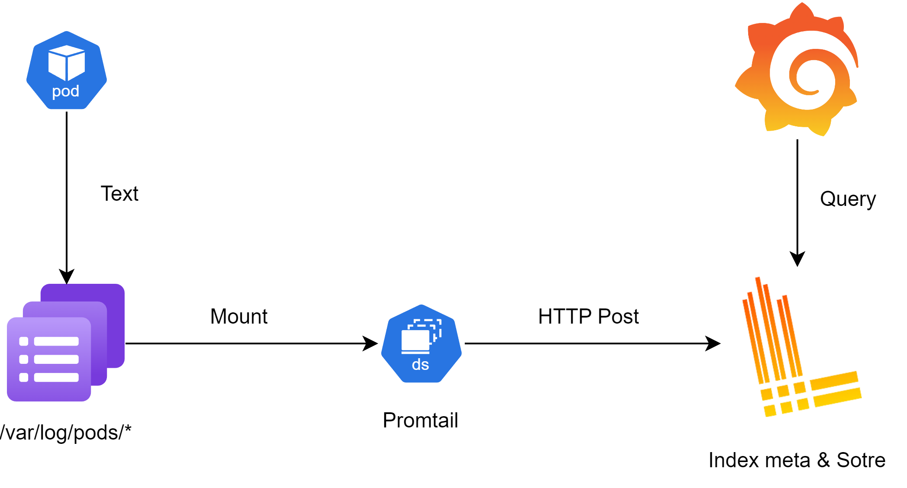
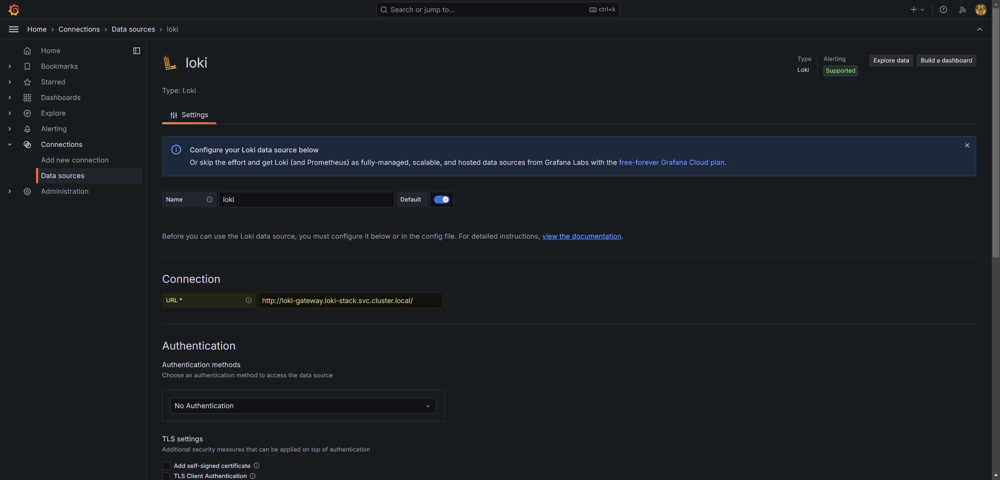
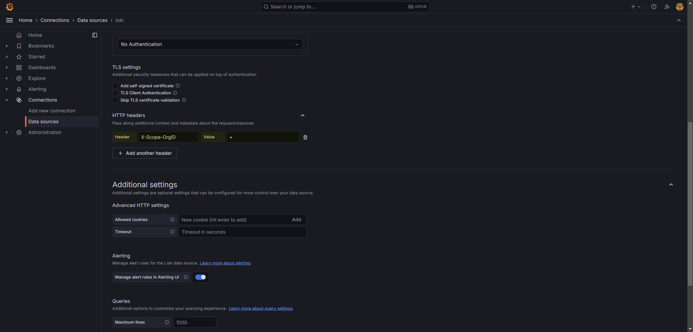
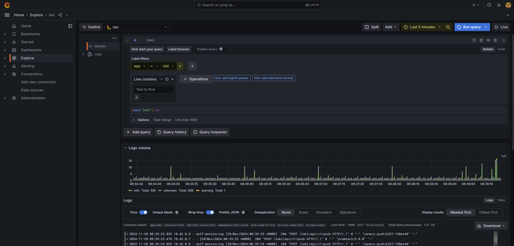

## [Loki](https://github.com/grafana/loki)

Logging selection：

- :thumbsdown: EFK/ELK: Elasticsearch + Fluentd/Logstash + Kibana
  - High resource consumption
  - High complexity with significant maintenance costs
  - Difficult to integrate with Grafana
  - Higher storage costs
- :thumbsup: **Loki: Loki + Promtail + Grafana**
  - Light-weighted
  - Easy to integrate with Granafa
  - **Lower storage cost by indexing timestamp + labels.**
  - More efficient log processing

### Architecture



### Component

- (W) **Distributor**: receives log data from clients and distributes it to the **Ingester**.
- (W) **Ingester**: receives and **stages** log data from the Distributor, then writes it to cloud storage.
- (R) **Query Frontend**: handles query requests from clients, managing query scheduling and caching to improve query response speed.
- (R) **Querier**: reads log data from storage and returns to the user. retrieving and filtering log data based on user query conditions.
- **Ruler**: executes predefined queries and alerting rules, generating alerts or other analytical results based on log data.
- **Compactor**: merges and compresses log chunks to reduce storage usage and improve query performance.


### Data format

- The [**index**](https://grafana.com/docs/loki/latest/get-started/architecture/#index-format) is a table of contents of where to find logs for a specific set of labels.
- The [**chunk**](https://grafana.com/docs/loki/latest/get-started/architecture/#chunk-format) is a container for log entries for a specific set of labels.


### [Deployment modes](https://grafana.com/docs/loki/latest/get-started/deployment-modes/)

#### Monolithic mode

- The simplest, suitable for quick start.
- Use `-target=all` at startup to deploy in single-binary mode.
- Runs all components as a single process in a binary format.
- Supports horizontal scaling by configuring the `replication_factor` parameter.
- **Up to around 20GB of log read/write volume per day.**


#### Simple Scalable

- The recommended, default installation mode.
- R/W separation strategy, allowing read and write components to scale independently.
- Requires a reverse proxy to route requests to the read and write nodes.
- The simplest way to deploy Loki at scale, situated between single-binary mode and microservices mode.
- **Suitable for log volumes of several TB per day.**
- Different components share the same image, but flags vary.
  - `-target=write`: starts as a write component, stateful.
  - `-target=read`: starts as a read component, stateless.
  - `-target=backend`: starts as a backend service, stateful.


#### Microservices mode

- Components as distinct processes. Each process is invoked specifying its `target`.
- Provides more granularity, letting you scale each component as individual microservice.
- Most complex to set up and maintain.
- **Suitable for log volumes of several 10+ TB per day.**


### Production

```yaml
# enable TSDB for index store
loki:
  schemaConfig:
    configs:
      - from: "2024-01-01"
        store: tsdb
        schema: v13
        index:
          prefix: loki_index_
          period: 24h
```

```yaml
# object storage
loki:
  storage:
    bucketNames:
      chunks:
      ruler: 
      admin: 
    type: s3
    s3:
      endpoint: 
      region: 
      secretAccessKey: 
      accessKeyId: 
```

```yaml
# multi-tenant allows enum in X-Scope-OrgID
loki:
  querier:
    multi_tenant_queries_enabled: true

# Promtail needs to specify tenant_id
config:
  clients:
    - url: http://loki-gateway/loki/api/v1/push
      tenant_id: 1
```

### Hands-on

Get grafana dashboard login password.

```bash
kubectl get secret -n loki-stack grafana -o jsonpath="{.data.admin-password}" | base64 -d; echo
```

Add loki data source given connection & HTTP header where `X-Scope-OrgID` = 1.





Check the logs of pods labeled `app=loki` in the last 5 min.



#### LogQL

`|` as pipeline operator.

- **`|=`**: log line contains the specified keyword.
- **`!=`**: log line does not contain the specified keyword.
- **`|~`**: log line contains a keyword that matches a regex.
- **`!~`**: log line does not contain a keyword that matches a regex.

```bash
# {app="loki"}    as selector
# |= `metrics.go` as pipeline operator
{app="loki"} |= `metrics.go`
```

logfmt

```bash
# {app="loki"} |= `metrics.go` | [logfmt|JSON] | (expr on Key)
{app="loki"} |= `metrics.go` | logfmt | duration > 5ms
```

line_format

```bash
{app="loki"} |= `metrics.go` | logfmt | line_format "state: {{.status}} duration: {{.duration}}"
```

Metric + GroupBy

```bash
# 99th percentile of the duration values (99% are below)  in the past 1min.
quantile_over_time(0.99, {app="loki"} |= `metrics.go` | logfmt | unwrap duration(duration) [1m]) by (status)
```

Others

```bash
# Delete color codes from logs: 
# This operation removes any color formatting codes from the log entries.
{job="example"} | decolorize

# Label formatting (renaming, modifying, or adding labels): 
# This operation allows you to rename an existing label or modify its value.
# For example, the following command renames the 'status' label to 'new_status':
| label_format status=new_status

# Delete label expression: 
# This operation removes the specified label from the log entries.
# For example, the following command removes the 'status' label:
| drop status

# Keep label expression (only retain specified labels): 
# This operation filters the log entries to keep only the specified labels.
# For example, the following command retains only the 'status' label:
| keep status
```


