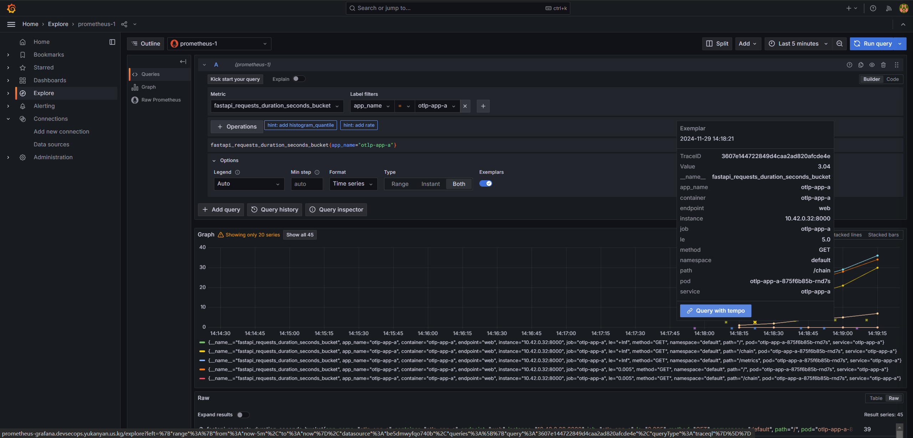

## [OpenTelemetry](https://opentelemetry.io/)

[OpenTracing](https://opentracing.io/) + [OpenCensus](https://opencensus.io/), which aims to **standardize** tracing + metrics + logs.

It provides **unified API & SDK** to simplify the collection of observability data **across different languages and platforms**.

It does not consider how the data will be used, stored, displayed, or alerted = **Backend-agnostic**.

**Integration**: OTel SDK, OpenTelemetry Collector.

:smiley: Grafana family: Tempo, Prometheus, Loki, Grafana.


### Signals

#### [Traces](https://opentelemetry.io/docs/concepts/signals/traces/)

- `context`: an immutable object on every span.
  - The Trace ID representing the trace that the span is a part of
  - The span’s Span ID
  - Trace Flags, a binary encoding containing information about the trace
  - Trace State, a list of key-value pairs that can carry vendor-specific trace information
- `atributes`: key-value pairs that contain metadata that you can use to annotate a Span.
- `events`:  a structured log message on a Span, typically used to denote a meaningful, singular point in time.
- `links`: allow you can associate with span(s), implying a causal relationship (not parent-child).
- `status`:
  - `Unset`: operation it tracked successfully completed without an error.
  - `Error`: some error occurred in the operation it tracks.
  - `OK`: span was explicitly marked as error-free by the developer of an application.

```json
{
  "name": "hello",
  "context": {
    "trace_id": "5b8aa5a2d2c872e8321cf37308d69df2",
    "span_id": "051581bf3cb55c13"
  },
  "parent_id": null,
  "start_time": "2022-04-29T18:52:58.114201Z",
  "end_time": "2022-04-29T18:52:58.114687Z",
  "attributes": {
    "http.route": "some_route1"
  },
  "events": [
    {
      "name": "Guten Tag!",
      "timestamp": "2022-04-29T18:52:58.114561Z",
      "attributes": {
        "event_attributes": 1
      }
    }
  ]
}

```

#### [Metrics](https://opentelemetry.io/docs/concepts/signals/metrics/)

[Instrument](https://opentelemetry.io/docs/concepts/signals/metrics/#metric-instruments) for capturing the metrics.

##### [Data Model](https://opentelemetry.io/docs/specs/otel/metrics/data-model/)

It is designed as a standard for **transporting** metric data.

- [Event Model](https://opentelemetry.io/docs/specs/otel/metrics/data-model/) is where recording of data happens.
  - Its foundation is made of [Instruments](https://opentelemetry.io/docs/specs/otel/metrics/api/#instrument), which are used to record data observations via events by `ValueRecorder`.
  - Raw events will be transformed in fashion before sending to other systems.
    - [Sum](https://github.com/open-telemetry/opentelemetry-proto/blob/c5c8b28012583fda55b0cb16f73a820722171d49/opentelemetry/proto/metrics/v1/metrics.proto#L247): represents an *Aggregation Temporality* of delta or cumulative - (start,end] time window.
    - [Gauge](https://github.com/open-telemetry/opentelemetry-proto/blob/c5c8b28012583fda55b0cb16f73a820722171d49/opentelemetry/proto/metrics/v1/metrics.proto#L241): represents a (last) sampled value at a given time.
    - [Histogram](https://github.com/open-telemetry/opentelemetry-proto/blob/c5c8b28012583fda55b0cb16f73a820722171d49/opentelemetry/proto/metrics/v1/metrics.proto#L260): conveys a population of recorded measurements in a compressed format.


:confused: **How to associate Metrics with Traces?**

:smile: By annotating trace_id & span_id.

:confused: **How to associate Logs with Traces?**

:smile: By printing trace_id & span_id from SpanContext.

#### [Logs](https://opentelemetry.io/docs/concepts/signals/logs/)

A **log** is a timestamped text record, either structured (recommended) or unstructured, with optional metadata.

### Components

#### [Collector](https://opentelemetry.io/docs/collector/)

It offers a **vendor-agnostic** implementation of how to receive, process and export telemetry data.

**Pipeline** = **Reciver** x O → (Fan-in) → **Processor** (on Traces/Metrics/Logs) x P → (Fan-out) → **Exporter** x Q.


### [Data Flow](https://opentelemetry.io/docs/demo/collector-data-flow-dashboard/)

Typical


### [Integration](https://opentelemetry.io/ecosystem/integrations/)

[Zero-code](https://opentelemetry.io/docs/concepts/instrumentation/zero-code/) = agent-like

[APIs & SDKs](https://opentelemetry.io/docs/languages/)

| Feature                | SDK                                  | Automatic Integration                                        |
| ---------------------- | ------------------------------------ | ------------------------------------------------------------ |
| Source Code            | Requires changes to source logic     | Small amount of coding, cannot be completely non-intrusive   |
| Customization          | Better customization                 | Average level of customization, can only be achieved by overriding built-in variables |
| Additional Tools       | No need to introduce extra launchers | Requires additional dynamic libraries or launchers, depending on the language itself |
| Integration Difficulty | Higher integration difficulty        | Lower integration difficulty                                 |

### [Sampling](https://opentelemetry.io/docs/concepts/sampling/)

1% is acceptable.

When & When not.

Head or Tail.

### Hands-on

```bash
cd tutorial/observability/opentelemetry
export KUBECONFIG=../../../iac/config.yaml
```

#### Demo#1

> OTel Python SDK

Install dependencies.

```bash
pip install -r pip install -r src/demo1/requirements.txt
```

Run locally.

```bash
python src/demo1/main.py
```

Build & push image.

```bash
docker build -t <repo_name>/<image_name>:v0.1.0 .
docker push <repo_name>/<image_name>:v0.1.0
```

Apply demo app & ServiceMonitor to cluster. Note: update image in manifests if necessary.

```bash
kubectl apply -f manifest/demo1/
```

Access demo app & download metrics by appending `/metrics` in URL.


Add tempo & loki datasource in grafana dashboard. Note: set org id.


Query demo app logs.


Check trace in tempo.


#### Demo#2

> **Loki** <--- trace_id ---> **Tempo** <--- trace_id ---> **Prometheus**

Configure **Loki** data source.


Configure **Prometheus** data source. Note: you need to create a new one instead of default provisioned one.

```bash
# connection URL
http://kube-prometheus-stack-prometheus.monitoring:9090/
```


Configure **Tempo** to correlate with **Loki** & **Prometheus** by tags.

```bash
# query
histogram_quantile(0.95,sum(rate(fastapi_requests_duration_seconds_bucket{$__tags}[$__rate_interval])) by (le))
```


Verify: Loki 👉 Tempo.


Verify: Prmetheus 👉 Tempo.





Verify: Tempo 👉 Loki & Prometheus.


Verify: Tempo 👉 Prometheus.


#### Demo#3

> Zero-code instrumentation

Install dependencies.

```bash
pip install -r pip install -r src/demo3/requirements.txt
```

Run locally.

```bash
python src/demo3/main.py
```

Build & push image.

```bash
docker build -t <repo_name>/<image_name>:v0.1.0 .
docker push <repo_name>/<image_name>:v0.1.0
```

Apply demo app & ServiceMonitor to cluster. Note: update image in manifests if necessary.

```bash
kubectl apply -f manifest/demo3/
```

Check on grafana dashboard.

