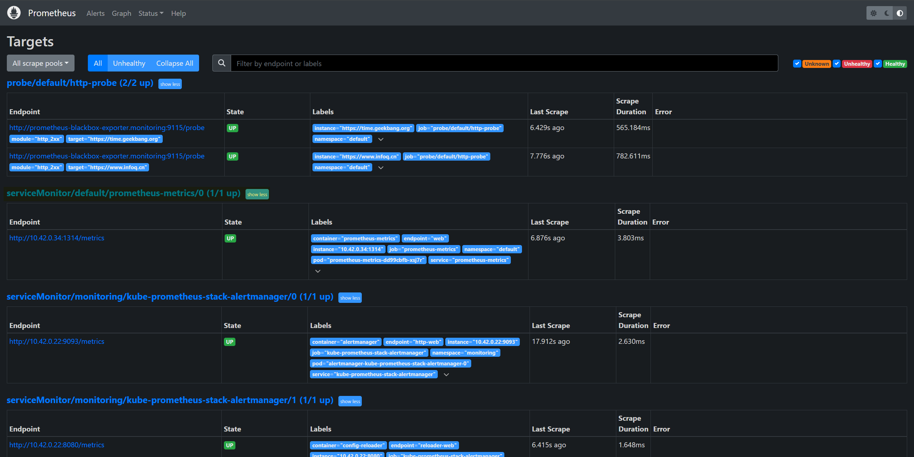

## [Prometheus](https://prometheus.io/docs/introduction/overview/)

An open-source systems monitoring and alerting toolkit, it  collects and stores its metrics as time series data.

### [Resource metrics pipeline](https://kubernetes.io/docs/tasks/debug/debug-cluster/resource-metrics-pipeline/)

- [cAdvisor](https://github.com/google/cadvisor): Daemon for collecting, aggregating and exposing container metrics included in Kubelet.
- [kubelet](https://kubernetes.io/docs/concepts/architecture/#kubelet): Node agent for managing container resources. Resource metrics are accessible using the `/metrics/resource` and `/stats` kubelet API endpoints.
- [metrics-server](https://kubernetes.io/docs/tasks/debug/debug-cluster/resource-metrics-pipeline/#metrics-server): Cluster addon component that collects and aggregates resource metrics pulled from each kubelet. The API server serves Metrics API for use by HPA, VPA, and by the `kubectl top` command. Metrics Server is a reference implementation of the Metrics API.
- [Metrics API](https://kubernetes.io/docs/tasks/debug/debug-cluster/resource-metrics-pipeline/#metrics-api): Kubernetes API supporting access to CPU and memory used for workload autoscaling. To make this work in your cluster, you need an API extension server that provides the Metrics API.


```bash
# env var
NODE_NAME="test-control-plane"

# local proxy
kubectl proxy

# k8s metrics
curl http://127.0.0.1:8001/api/v1/nodes/${NODE_NAME}/proxy/metrics/cadvisor
curl http://127.0.0.1:8001/api/v1/nodes/${NODE_NAME}/proxy/metrics/resource
curl http://127.0.0.1:8001/api/v1/nodes/${NODE_NAME}/proxy/metrics/probes
```

#### Scaper

```yaml
# ...
metrics_path: /metrics/[cadvisor|resource|probes]
# ...
kubernetes_sd_configs:
- role: endpoints
```

### Metric Types

A *counter* represents a single [monotonically increasing counter](https://en.wikipedia.org/wiki/Monotonic_function) whose value can only increase or be reset to zero on restart.

A *gauge*represents a single numerical value that can arbitrarily go up and down.

A *histogram* (**accumulative**) samples and counts them in configurable buckets (bucket behind contains all counts of prev buckets). 

a *summary* samples and calculates configurable quantiles over a sliding time window.

### [Prometheus Operator](https://github.com/prometheus-operator/prometheus-operator)

It simplifies and automates the configuration of a Prometheus based monitoring stack for Kubernetes clusters by **CRD**.

[CRDs](https://github.com/prometheus-operator/prometheus-operator?tab=readme-ov-file#customresourcedefinitions)

- StatefulSet
  - **`Prometheus`**, which defines a desired Prometheus deployment.
  - **`PrometheusAgent`**, which defines a desired Prometheus deployment, but running in Agent mode.
  - **`Alertmanager`**, which defines a desired Alertmanager deployment.
  - **`ThanosRuler`**, which defines a desired Thanos Ruler deployment.
- Config Object
  - **`ServiceMonitor`**, which declaratively specifies how groups of Kubernetes services should be monitored. The Operator automatically generates Prometheus scrape configuration based on the current state of the objects in the API server.
  - **`PodMonitor`**, which declaratively specifies how group of pods should be monitored. The Operator automatically generates Prometheus scrape configuration based on the current state of the objects in the API server.
  - **`Probe`**, which declaratively specifies how groups of ingresses or static targets should be monitored. The Operator automatically generates Prometheus scrape configuration based on the definition.
  - **`ScrapeConfig`**, which declaratively specifies scrape configurations to be added to Prometheus. This CustomResourceDefinition helps with scraping resources outside the Kubernetes cluster.
  - **`PrometheusRule`**, which defines a desired set of Prometheus alerting and/or recording rules. The Operator generates a rule file, which can be used by Prometheus instances.
  - **`AlertmanagerConfig`**, which declaratively specifies subsections of the Alertmanager configuration, allowing routing of alerts to custom receivers, and setting inhibit rules.


### [Kube-Prometheus-Stack](https://artifacthub.io/packages/helm/prometheus-community/kube-prometheus-stack)

A collection of Kubernetes manifests, [Grafana](http://grafana.com/) dashboards, and [Prometheus rules](https://prometheus.io/docs/prometheus/latest/configuration/recording_rules/) combined with documentation and scripts to provide easy to operate end-to-end Kubernetes cluster monitoring with [Prometheus](https://prometheus.io/) using the [Prometheus Operator](https://github.com/prometheus-operator/prometheus-operator).

:smile: **Out-of-box**: built-in scraper, relabel & alert rules.

#### Scaper

CRD

- **ServiceMonitor** via label selector (*)
- **PodMonitor** via label selector

Default relabeling

| Label     | Source                               | Label Description                                            |
| --------- | ------------------------------------ | ------------------------------------------------------------ |
| instance  | __param_target                       | Target address being scraped                                 |
| job       | -                                    | {metadata.name} of the scraped service or read from jobLabel |
| node/pod  | -                                    | Set according to the requested service                       |
| namespace | __meta_kubernetes_namespace          | {metadata.namespace} of the scraped pod                      |
| service   | -                                    | {metadata.name} of the Service                               |
| pod       | __meta_kubernetes_pod_name           | {metadata.name} of the Pod                                   |
| container | __meta_kubernetes_pod_container_name | Name of the Pod container                                    |
| endpoint  | -                                    | {spec.Port} or {spec.TargetPort}                             |

### vs.

```bash
# loki
# log stream selector + log line operator
{app="loki"} |= `metrics.go`

# prometheus
# metric selector + label selector
http_requests_total{app="loki"}
```

**Choose Histogram, otherwise Summary**:

- If **aggregation** is needed.
- If **range** is known.

| Feature                   | Histogram                                                    | Summary                                                  |
| ------------------------- | ------------------------------------------------------------ | -------------------------------------------------------- |
| **Quantile Expression**   | `histogram_quantile(0.95, sum(rate(...)))`                   | `http_request_duration_seconds_summary{quantile="0.95"}` |
| **Client Configuration**  | Requires appropriate bucket selection for φ quantiles and sliding window | Client overhead is low; essentially counter type         |
| **Client Calculation**    | Needs to perform streaming quantile calculations             | Not required; relies on server-side calculations         |
| **Server Overhead**       | High; quantiles are calculated on the server                 | Low; server only handles queries, no calculations        |
| **Time Series Count**     | One time series per bucket (excluding `_sum` and `_count`)   | One time series per quantile                             |
| **Aggregation Functions** | Supports aggregation functions                               | Does not support aggregation functions                   |
| **Error Precision**       | Error precision depends on bucket configuration              | Error in φ dimension constrained by configurable values  |

### Aggregation

```bash
# QPS of HTTP requests for a specific job ("app") over the last minute
# sums these rates, grouping the results by the request path.
sum(
  rate(
    total_http_requests{job="app"}[1m]
  )
) by (path)
```

```bash
# 95th percentile of HTTP response times for the job "week9-app".
histogram_quantile(
    0.95,
    sum(
        rate(
            http_response_time_seconds_bucket{job="app"}[1m]
        )
    )
    by (le)
)
```

### Production

- Customize histogram bucket if necessary.
  - For example, if `http_response_time_seconds` is around 100ms~200ms.
  - Given bucket: [5ms、10ms、25ms、50ms、**100ms、250ms**、500ms、1000ms、2500ms、5000ms、10000ms] which is by default in Golang SDK.
  - If you noticed P90/95/99 exceed the range, means bucket is set improperly.
- **Don't use annotations for scraping.**
  - Application definitions and monitoring configurations should be separated.
  - Limitations:
    - Does not support multiple metric ports.
    - Does not support authentication and TLS configuration.
    - Does not support label selection.

### [Alertmanager](https://prometheus.io/docs/alerting/latest/alertmanager/)

It handles alerts sent by client applications such as the Prometheus server.

It takes care of deduplicating, grouping, and **routing** them **to** the correct **receiver** integration such as email.

It also takes care of **silencing and inhibition** of alerts.

|                                | Grafana Alert                         | Alertmanager                                      |
| ------------------------------ | ------------------------------------- | ------------------------------------------------- |
| Metric Source                  | Prometheus, Loki, Other Datasources   | Prometheus                                        |
| CRD Alert Policy Configuration | Not supported                         | Supported                                         |
| API                            | Prometheus Query: /api/v1/query_range | Instant Query: /api/v1/query (higher performance) |
| SaaS Support                   | Grafana Cloud                         | Cloud Alertmanager                                |


#### [Concept](https://prometheus.io/docs/alerting/latest/alertmanager/)

**Grouping** categorizes alerts of similar nature into a single notification.

**Inhibition** is a concept of suppressing notifications for certain alerts if certain other alerts are already firing.

**Silences** are a straightforward way to simply mute alerts for a given time.

#### Route

`<route>` defines a node in a routing tree and its children.

- Match recipients based on the routing tree.
- A recipient can be configured with multiple notifiers, allowing notifications to be sent to different channels.
- Execute notification jobs to handle notification sending, retries, and deduplication of data.

#### [Receiver](https://prometheus.io/docs/alerting/latest/configuration/#receiver-integration-settings)

#### [HA](https://promlabs.com/blog/2023/08/31/high-availability-for-prometheus-and-alertmanager-an-overview/)

```yaml
# each PM points to a set of AMs.
alerting:
  alertmanagers:
  - static_configs:
    - targets:
      - alertmanager1:9093
	  - alertmanager2:9093
	  - alertmanager3:9093
```

#### Production

- **Alert Fatigue**
  - Excessive alerts lead to neglect, eventually resulting in production incidents.
- **Production Practices**
  - Optimization of Alertmanager route parameters:
    - **group_wait:** The duration to wait before sending alerts for a group (usually to allow for alert suppression or to collect more alerts from the same group), default is 30 seconds.
    - **group_interval:** The time to wait before sending new alerts for the same group, default is 5 minutes.
    - **repeat_interval:**
  - Reasonable grouping of alert rules reduces the number of alerts and sets appropriate trigger durations.
    - **group_by:** For example, group by namespace, cluster, or data center; grouping by instance is not recommended.
    - **for:** 5 minutes, 10 minutes.
  - Higher-level alert targets, such as targeting data centers instead of instance-level.
  - Provide runbooks and dashboard links when issuing alerts for quicker resolution in annotation.

### Hands-on

Grafana dashboard.


#### Demo#1

> Site-availability monitoring (black box)

> Endpoint: http://blackbox-exporter-prometheus-blackbox-exporter.monitoring:9115/probe?module=http_2xx&target=url


Uncomment `helm_prometheus.tf` and install [blackbox-exporter](https://artifacthub.io/packages/helm/prometheus-community/prometheus-blackbox-exporter).

```bash
resource "helm_release" "prometheus-demo1" {
  name             = "prometheus-blackbox-exporter"
  repository       = "https://prometheus-community.github.io/helm-charts"
  chart            = "prometheus-blackbox-exporter"
  namespace        = "monitoring"
  version          = "v9.1.0"
  create_namespace = true
}
```

```bash
terraform apply --auto-approve
```

Open a new terminal & head to directory.

```bash
cd tutorial/observability/prometheus
export KUBECONFIG=../../../iac/config.yaml
```

Create blackbox probe & dashboard.

```bash
kubectl apply -f manifest/demo1/
```

Check on prometheus dashboard.


Check on grafana dashboard.


#### Demo#2

> Expose metrics by [Golang SDK](https://prometheus.io/docs/guides/go-application/) (white box)

Run demo app locally.

```bash
cd src/demo2/app && go run main.go
```

Access URLs (for multiple times) then access metrics.

- http://localhost:1314/api/health
- http://localhost:1314/api/pay
- http://localhost:1314/api/cart
- http://localhost:1314/api/error
- **http://localhost:1314/metrics**

Create demo app in cluster.

```bash
# modify ingress if necessary
kubectl apply -f manifest/demo2/metrics-app.yaml
```

Access URLs.

- http://prometheus-metrics-app.prefix.domain/health
- http://prometheus-metrics-app.prefix.domain/pay
- http://prometheus-metrics-app.prefix.domain/cart
- http://prometheus-metrics-app.prefix.domain/error
- http://prometheus-metrics-app.prefix.domain/metrics


Deploy ServiceMonitor to scrape metrics.

```bash
kubectl apply -f manifest/demo2/servicemonitor-metrics-app.yaml
```

Check on prometheus dashboard.




Check on grafana dashboard.


#### Demo#3

> Import dashboard

Apply dashboard configmap.

```bash
kubectl apply -f manifest/demo3/dashboard.yaml
```

Create dashboard on grafana dashboard.


#### Demo#4

> Alertmanager

Apply prometheus rule.

```bash
kubectl apply -f manifest/demo4/prometheusrule-qps.yaml
kubectl apply -f manifest/demo4/prometheusrule-error.yaml
```

Check on prometheus dashboard.


