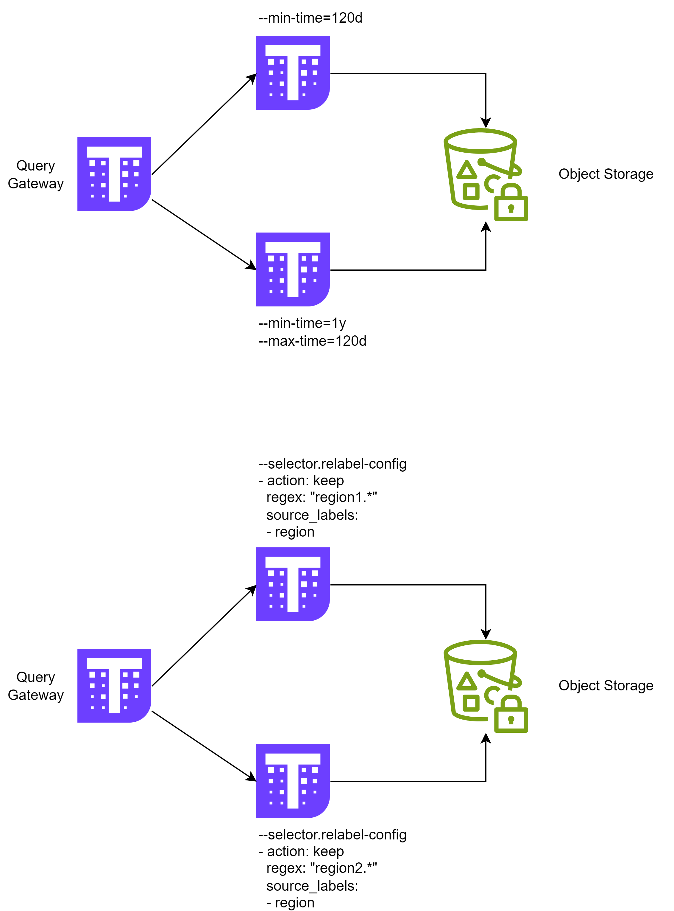
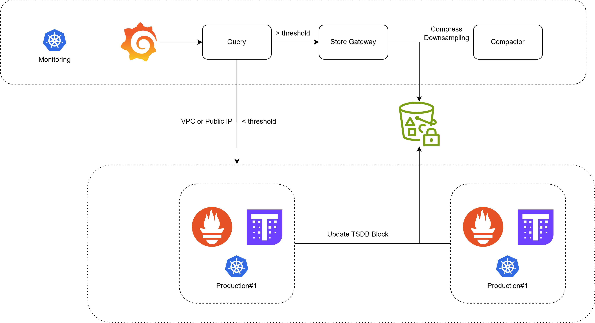
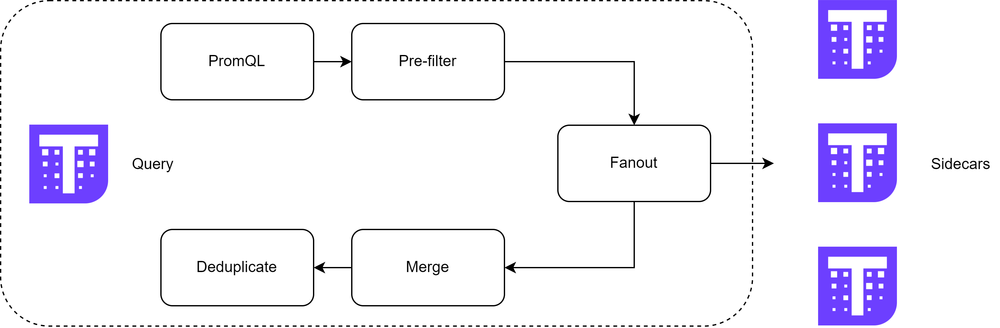
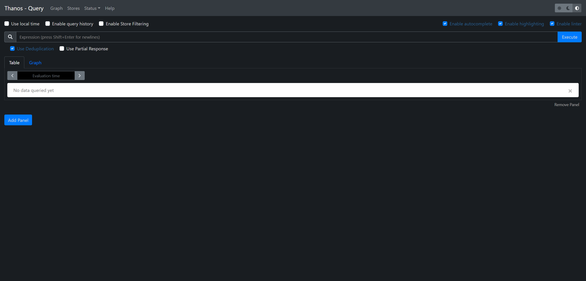
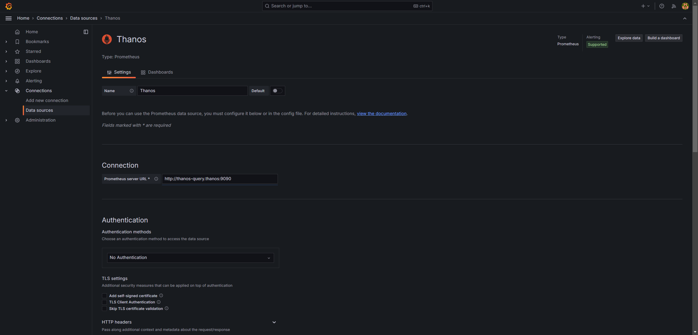
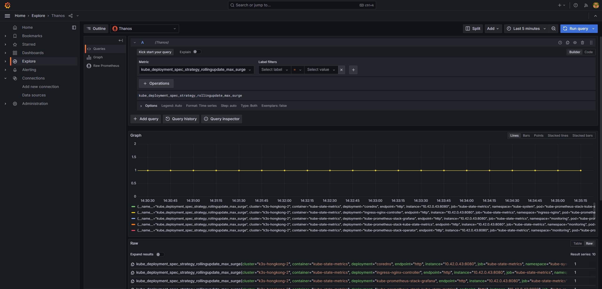

## [Thanos](https://thanos.io/)

:disappointed: Challenges of Prometheus in production

- TSDB
  - Limited by Maximum Single Instance Capacity，not a long-term storage solution (over the course of years)
  - Solution: **[remote](https://prometheus.io/blog/2019/10/10/remote-read-meets-streaming/) R/W**
- Availability
  - Duplicate query results and no global view
  - Solution:
    1. Multi-instance + Proxy 👉 Consistency issue
    2. Multi-instance + Remote central storage 👉 Multi-cluster extension issue
    3. Multi-instance + Remote central storage + Federation (for metrics aggregation) 👉 Maintenance costs & complexity

:thinking: Mindset

- Apply remote storage to make Prometheus nearly stateless
- HA while leaving deduplication consistency to other tools

:smile: Thanos: a **HA** Prometheus setup with **long-term storage** capabilities.

| System     | Model | Performance    | Data Persistence                                     | Latency | Complexity | Cost   |
| ---------- | ----- | -------------- | ---------------------------------------------------- | ------- | ---------- | ------ |
| **M3DB**   | Push  | Good           | Immediate                                            | Low     | Low        | Low    |
| **Cortex** | Pull  | Good           | Immediate                                            | Varies  | Simple     | Varies |
|            |       |                | May lose data due to network issues                  |         |            |        |
|            |       |                | Chunks Storage: High                                 |         |            |        |
|            |       |                | Block Storage: Low                                   |         |            |        |
| **Thanos** | Pull  | Slightly Lower | Not immediate (default 2-hour delay)                 | High    | Simple     | Low    |
|            |       |                | May lose last 2 hours of metrics if Prometheus fails |         |            |        |

### Architecture

> Sidecar mode


> Receive + Remote write


> Simple


### Components

- **Query Gateway**: implements the Prometheus V1 API and aggregates data.
- **Sidecar**: connects to Prometheus and provides data querying or uploads blocks to object storage.
- **Store Gateway**: to object storage.
- **Query Frontend**: provides query splitting and caching services for the Query Gateway (optional).
- **Compactor**: compresses and downsamples metrics in remote storage (optional).
- **Receiver**:receives data via Prometheus's remote write feature and uploads it to cloud storage (optional).
- **Ruler**: manages alerting.

### Production

Prometheus **scrape interval** (15s) refers to time granularity or sampling frequency.

Prometheus **step** specifies the **resolution** of the data points in a query, aggregates them to avoid too many samples **on display**.

```sql
# rate over the last hour, with data points aggregated every minute.
sum(rate(http_requests_total[5m]))[1h:1m]
```

#### Challenge

However, the total number of metrics in storage does not change at all. Besides, metrics need to be read from compressed chunk, and this requires de-compressing (10~40ns) per metric, what a ... :cry:

| Interval (15s) | Samples        | Time cost | Data size |
| -------------- | -------------- | --------- | --------- |
| 30m            | ~120,000       | ~5ms      | ~160KB    |
| 1d             | ~6,000,000     | ~240ms    | ~8MB      |
| 1y             | ~2,000,000,000 | ~1min20s  | ~2GB      |

#### Solution

:smile: **Downsampling**: Raw Block 👉 >40h 👉 5m (step) Block 👉 >10d 👉 1h (step) Block

:cry: Trandeoff: space 👉 time

Each chunk has 5 aggregation blocks, Thanos Compact will aggregate them.

```sql
# count
count(request_total)
count_over_time(request_total[1h])

# sum
sum_over_time(request_total[1h])

# max
max(request_total)
max_over_time(request_total[1h])

# min
min(request_total)
min_over_time(request_total[1h])

# counter
rate(request_total)
increase(request_total[1h])
```

Thanos automatically (when query) determines which resolution blocks to use based on the load to reduce size of retrieved data.

| Interval (15s) | Samples        | Time cost   | Data Size |
| -------------- | -------------- | ----------- | --------- |
| 30 days        | ~0.17 billion  | ~7s         | ~240MB    |
| **30 days**    | **~8 million** | **~300 ms** | **~9 MB** |
| 1 year         | ~2 billion     | ~1 min      | ~20 GB    |
| **1 year**     | **~8 million** | **~300 ms** | **~9 MB** |

:confused: **Why does 30d cost same as 1y?**

:smile: 30d:1y = 1/12 = 5min block: 1h block

#### Best practice

- Deploy [query frontend](https://thanos.io/tip/components/query-frontend.md/) for caching
- [Configure](https://thanos.io/tip/components/compact.md/) downsampling
- Reduce the collection of high cardinality metrics such as request/session id, apply grouping & aggregation for them.
- Apply [sharding](https://thanos.io/tip/proposals-accepted/202205-vertical-query-sharding.md/) when storage up to PB, [configure](https://thanos.io/tip/components/store.md/) in Thanos Store.
  - By time
    - `--min-time`
    - `--max-time`
  - By label, for example region=<regex>
    - `--selector.relabel-config`
- Configure Prometheus Operator `.spec.replicas` & `.spec.shards`, Thanos will de-duplicate for it.



### Multi-cluster + Global view

> 





### Hands-on

#### [kube-thanos](https://github.com/thanos-io/kube-thanos)

```bash
# install jb
go install github.com/jsonnet-bundler/jsonnet-bundler/cmd/jb@latest
go install github.com/brancz/gojsontoyaml@latest
go install github.com/google/go-jsonnet/cmd/jsonnet@latest

# slink
sudo ln -s $GOPATH/bin/jb /usr/local/bin
sudo ln -s $GOPATH/bin/gojsontoyaml /usr/local/bin
sudo ln -s $GOPATH/bin/jsonnet /usr/local/bi

# install kube-tanos
jb install github.com/thanos-io/kube-thanos/jsonnet/kube-thanos@main

# customize jsonnet & compile
# or u may directly head to https://github.com/thanos-io/kube-thanos/tree/main/manifests
./build.sh thanos.jsonnet
```

#### Demo#1

> Prometheus + Thanos

Check on thanos query dashboard.



Add data source in grafana dashboard.



Explore.



#### Demo#2

> Multi-cluster + Global view

**TODO**