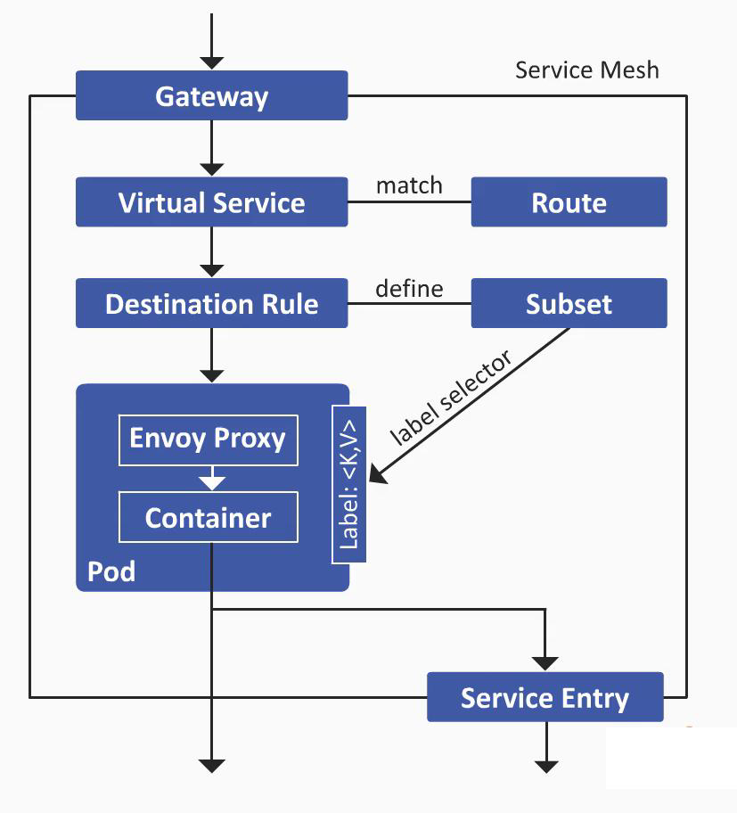

## Release


### [RollingUpdate](https://kubernetes.io/docs/concepts/workloads/controllers/deployment/#strategy)

K8s default deployment strategy to achieve zero-downtime updates.

- `maxUnavailable`: the maximum number of Pods that can be unavailable during the rolling update phase. (25%)
- `maxSurge`: the maximum number of additional Pods that can be launched during the rolling update phase. (25%)
- For example: when the number of replicas is 4
  - The maximum total number of Pods will not exceed 5 (4 + 4 * 25% maxSurge).
  - The maximum number of unavailable Pods will not exceed 1 (4 * 25% maxUnavailable)

Note: another strategy is: **Recreate**: pods will be killed first (downtime) before new ones are created. UCs:

- When you want to rebuild workloads quickly.
- If node resource is insufficient, pods will not be scheduled when rolling update.
- RWO PVC cannot be mounted multiple times.

### Blue/Green

During deployment, instead of directly replacing the original **blue** environment, a new **green** environment is created.

The **blue** environment continues to provide services, while the new green environment is available for QA testing.

Once validated, traffic is immediately switched to the **green** environment (by **service label selector**).

The **blue** environment will still retain traffic as a fallback. 

If the **green** environment encounters a failure, traffic can be switched back to the **blue** environment.

**Blue-green deployment provides fast-recovery trades off more resource.**


### Canary

Two environments: production environment and canary environment.

When releasing a new version, instead of a complete traffic switch, **a portion of the traffic is forwarded** to the canary environment.

Once validated, the traffic proportion to the canary environment can be gradually increased until it reaches 100%.

Requires two sets of workloads and two Services, with the help of a **gateway for traffic splitting**.

Controlled by **ingress annotation**.

:smile:

- Real traffic for testing.
- It may only affect a portion of users' experience.


### [Argo Rollout](https://argoproj.github.io/rollouts/)

A Kubernetes controller and set of CRDs which provide **built-in advanced deployment capabilities** such as blue-green, canary...

It usually needs to collborate with Ingress & Service mesh.

#### Blue/Green

Pods will be managed by Rollout CRD, when image is change, new pods will be created. 

Besides, **new labels will be added automatically** after promotion.

#### Canary

Introduce human approval to determine whether to increase weight or rollout.

New ingress will be created after promotion.

canary-weight will be set to 0 once canary becomes stable, and service label selector will point to canary env.

#### Progressive

Auto promotion based on metrics.

### Istio

#### Challenge

1. **Database & Middleware are not able to identify requests from multi-env (HTTP header)**
   - Solution#1: database & middleware for each env.
   - Solution#2: Modify biz logic, use the same instances but different database & middleware.
2. **API compatibility**
   - Solution#1: service mesh re-directs im-compatible API to specific env.
3. **In-service (East/West) traffic is hard to track (non-HTTP protocols like gRPC)**
   - Solution#1: <u>Istio VirtualService & DestinationRules</u>



### Hands-on

#### Demo#1

> RollingUpdate

Create deployment.

```bash
kubectl apply -f manifest/demo1/deployment-nginx.yaml
```

Update image.

```bash
kubectl set image deploy/nginx nginx=nginx:1.23
```

Pause.

```bash
kubectl rollout pasue deploy/nginx
```

Check container image.

```bash
kubectl get pods -l app=nginx -o jsonpath="{.items[*].spec.containers[0].image}" | tr " " "\n" | awk -F: '{print $2}'
```

Resume.

```bash
kubectl rollout resume deploy/nginx
```

Check container image.

```bash
kubectl get pods -l app=nginx -o jsonpath="{.items[*].spec.containers[0].image}" | tr " " "\n" | awk -F: '{print $2}'
```

#### Demo#2

> Recreate

Create deployment.

```bash
kubectl apply -f manifest/demo2/deployment-nginx.yaml
```

Update image.

```bash
kubectl set image deploy/nginx nginx=nginx:1.23
```

Check.

```bash
kubectl get pods -l app=nginx -w
```

#### Demo#3

> Blue/Green

Create blue deployment.

```bash
kubectl apply -f manifest/demo3/deployment-blue.yaml
kubectl apply -f manifest/demo3/service-blue.yaml
```

Port forward and check.

```bash
# in another terminal
kubectl port-forward service/myapp 30001:30001
while true; do curl 127.0.0.1:30001/version; echo; done
```

Create green deployment. (switch)

```bash
kubectl apply -f manifest/demo3/deployment-green.yaml
kubectl apply -f manifest/demo3/service-green.yaml
```

#### Demo#4

> Canary

Add local DNS resolution.

```bash
<ip> canary.demo
```

Create prod，canary deployment.

```bash
kubectl apply -f manifest/demo4/prod.yaml
kubectl apply -f manifest/demo4/canary.yaml
```

Check on browser http://canary.demo.

Create canary ingress.

```bash
kubectl apply -f manifest/demo4/ingress.yaml
```

Check on browser http://canary.demo.

Add header `X-location=shanghai` (chrome plugin), then check on browser http://canary.demo.

#### Demo#5

>Argo Rollout - Blue/Green

[Install](https://argoproj.github.io/argo-rollouts/installation/) argocd rollout & kubectl [plugin](https://argoproj.github.io/argo-rollouts/features/kubectl-plugin/).

Add local DNS resolution.

```bash
<ip> blue-green.dev.demo
<ip> blue-green-preview.dev.demo
```

Deploy blue/green rollout.

```bash
kubectl apply -f manifest/demo5/bluegreen-rollout.yaml
```

Deploy ingress.

```bash
kubectl apply -f manifest/demo5/bluegreen-ingress.yaml
```

Check on browser http://blue-green.dev.demo.

Check on rollout dashboard, and access http://localhost:3100/rollouts.

```bash
kubectl argo rollouts dashboard
```

Modify image from blue to green.

```bash
kubectl patch rollout bluegreen-demo \
	--type='json' \
	-p='[{"op": "replace", "path": "/spec/template/spec/containers/0/image", "value":"argoproj/rollouts-demo:green"}]'
```

Check on rollout dashboard again & pod.

```bash
kubectl get po
```

Create green ingress for preview.

```bash
kubectl apply -f manifest/demo5/bluegreen-ingress.preview.yaml
```

Check on browser http://blue-green-preview.dev.demo.

Back to rollout dashboard, promote blue to green or rollback.

#### Demo#6

>Argo Rollout - Canary

Deploy canary rollout.

```bash
kubectl apply -f manifest/demo6/canary-rollout.yaml
```

Deploy canary ingress.

```bash
kubectl apply -f manifest/demo6/canary-ingress.yaml
```

Add local DNS resolution.

```bash
<ip> canary.dev.demo
```

Check on browser http://canary.dev.demo.

Check on rollout dashboard, and access http://localhost:3100/rollouts.

Modify image from blue to green.

```bash
kubectl patch rollout canary-demo \
	--type='json' \
	-p='[{"op": "replace", "path": "/spec/template/spec/containers/0/image", "value":"argoproj/rollouts-demo:green"}]'
```

Check on browser http://canary.dev.demo.

Check on rollout dashboard, and access http://localhost:3100/rollouts. Promote blue to green.

#### Demo#7

>Argo Rollout - Progressive

Deploy canary rollout.

```bash
kubectl apply -f manifest/demo7/canary-rollout.yaml
```

Deploy canary ingress.

```bash
kubectl apply -f manifest/demo7/canary-ingress.yaml
```

Deploy analysis template.

```bash
kubectl apply -f manifest/demo7/analysis-template.yaml
```

Add local DNS resolution.

```bash
<ip> canary.analysis.dev.demo
```

Check on browser http://canary.analysis.dev.demo.

Check on rollout dashboard, and access http://localhost:3100/rollouts.

Modify image from blue to green.

```bash
kubectl patch rollout canary-analysis-demo \
	--type='json' \
	-p='[{"op": "replace", "path": "/spec/template/spec/containers/0/image", "value":"argoproj/rollouts-demo:green"}]'
```

Check on browser http://canary.analysis.dev.demo.

Check on rollout dashboard, and access http://localhost:3100/rollouts.

Modify image from green to blue to simulate another canary release.

```bash
kubectl patch rollout canary-analysis-demo \
	--type='json' \
	-p='[{"op": "replace", "path": "/spec/template/spec/containers/0/image", "value":"argoproj/rollouts-demo:green"}]'
```

Check on browser http://canary.analysis.dev.demo, scroll blue bar on top to 50% to simulate error.

Check on rollout dashboard, and access http://localhost:3100/rollouts.

#### Demo#8

> Istio gery

Install [istio](https://istio.io/latest/docs/setup/install/).

Install [bookinfo](https://istio.io/latest/docs/examples/bookinfo/).

Deploy review-v1.

```bash
kubectl apply -f manifest/demo8/virtual-service-all-v1.yaml
```

Check on productpage.

Deploy review-v2.

```bash
kubectl apply -f manifest/demo8/virtual-service-reviews-test-v2.yaml
```

Login with jason/jason.

Check on productpage.

