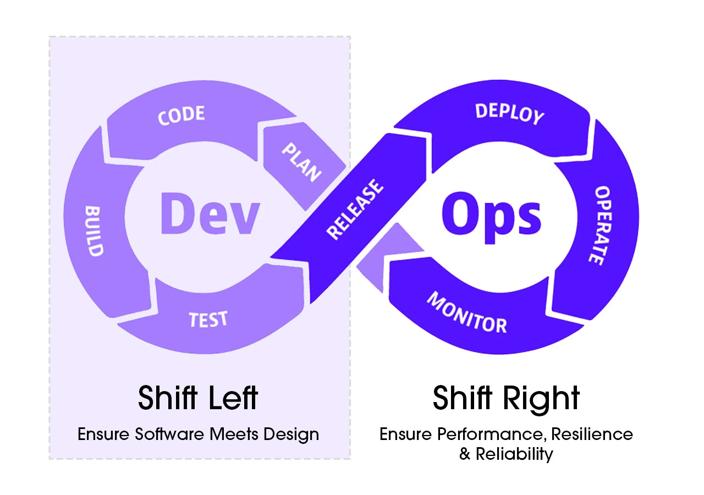
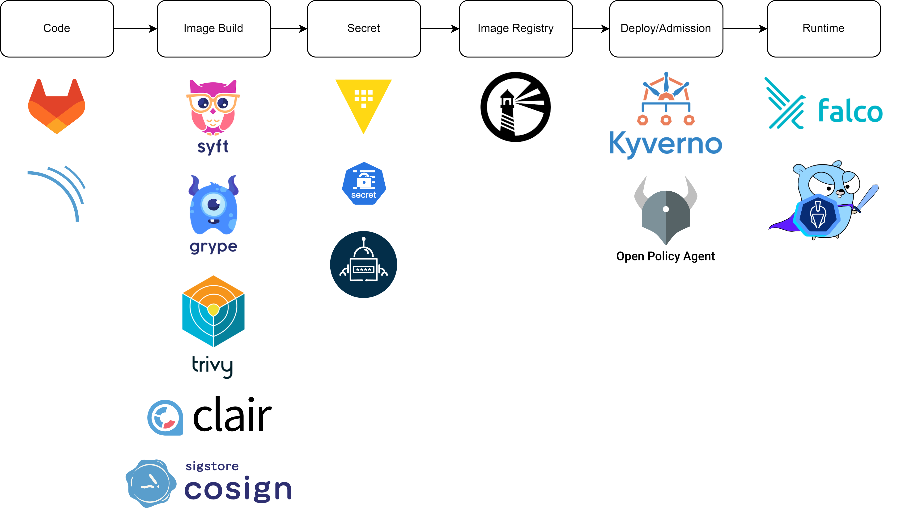
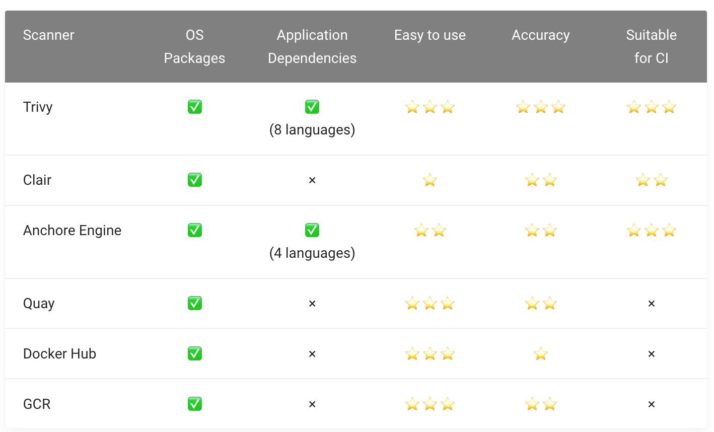

## Sec

DevSecOps = DevOps + **Security** (Shift-left principle)

- **SAST** - Static Application Security Testing
  - A "white-box testing" approach that tests the internal structure or workings of an application rather than its functionality.
  - Source code-level security scanning, such as SonarQube.
- **DAST** - Dynamic Application Security Testing
  - A "black-box testing" approach that scans the application while it is running.
  - For example, OWASP Zap.
- **IAST** - Interactive Application Security Testing
  - Uses software to detect vulnerabilities in applications
  - SAST + DAST

**Tools**

- Code: [Gitlab](https://about.gitlab.com/resources/), [SonarQube](https://www.sonarsource.com/products/sonarqube/)

- Build: [Syft](https://www.syftanalytics.com/), [Grype](https://github.com/anchore/grype), [Trivy](https://trivy.dev/latest/), [Clair](https://github.com/quay/clair), [Cosign](https://github.com/sigstore/cosign)

- Secret: [Sealed-secrets](https://github.com/bitnami-labs/sealed-secrets), [Vault](https://www.vaultproject.io/), [External-secrets](https://external-secrets.io/)

- Registry: [Harbor](https://goharbor.io/)

- Deploy: [Kyverno](https://kyverno.io/)

- Runtime: [Falco](https://falco.org/)

  

**"4C"**

- **Cloud**: account, vpc, security group, access control, firewall, ssh
- **Cluster**: AuthN, AuthZ, RBAC, network policy, admission control, secure runtime
- **Container**: manifest, dockerfile, trusted image, security scan, user, fs, privilege
- **Code**: static code scan, 3pp

### SBOM

> Code = Business Logic (20%) + Lib (80%) ← [CVE](https://cve.mitre.org) (Common Vulnerabilities and Exposures) + language-specific.

**Software Bill of Materials** is a comprehensive list of all the components, libraries, and dependencies used in a software product.

- **Linux Foundatino: SPDX**
- OWASP: CycloneDX
- Microsoft: SARIF
- GitHub: Open

Note: **Harbor** supports [SBOM](https://goharbor.io/docs/edge/administration/sbom-integration/) generation & management since 2.11.

#### Image

- **Dockerfile**: trusted image, non-root user
- **System application**: OpenSSL, Curl, etc.
- **Image scan**: Trivy (Syft + Grype) + Harbor (prevents image with CVEs to be deployed in clucster but it's better to shift left in CI)
- **Image signature**: Cosign

#### [vs](https://github.com/aquasecurity/trivy-db/tree/main/pkg/vulnsrc)

### Secret

:thumbsdown: Bass64 encoding ≈ plaintext; Namespaced = not cross-ns share-able

:hammer_and_wrench: Sealed-Secrets, External-Secrets (Vault, AWS/GCP Secrets Manager)

:question: How: CRD/CR (kept in src repo) + Operator (access external cred storage) → primitive Secret

### Deployment

Resource → **(pre)** → Cluster → **(post)** → Monitoring event → Alert
