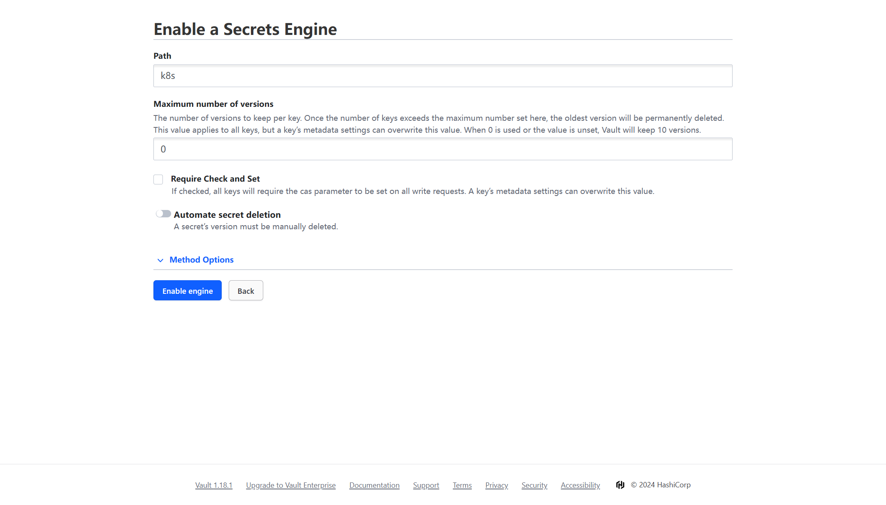

#### [External-secret](https://external-secrets.io/main/) + [Vault](https://www.vaultproject.io/)

**External Secrets Operator** is a Kubernetes operator that integrates external secret management systems.

The operator reads information from external APIs and automatically injects the values into a [Kubernetes Secret](https://kubernetes.io/docs/concepts/configuration/secret/).


### Hands-on

#### Demo#1

> Create a secret by Vault

[Install](https://developer.hashicorp.com/vault/docs/platform/k8s/helm) vault first then setup vault.

```bash
# port-forwarding
kubectl port-forward svc/vault 8200:8200

# export env
export VAULT_ADDR='http://127.0.0.1:8200'

# init
vault operator init

# unseal
vault operator unseal <token>
```

Create a policy named "example" on [gui](http://127.0.0.1:8200) (root token).

```json
path "*" {
  capabilities = ["read", "list"]
}
```


Enable `Username & Password` authentication method.


Create a user example/example, and select policy just created.


Create a K/V secret engine named "k8s".



Create a secret named "example" given secret data.


Logout & login by newly created user.


Get user token.


Create vault token secret.

```yaml
kubectl create secret generic vault-token \
--from-literal=token=BLOCKED \
-n external-secrets
```

Create cluster secret store.

```yaml
kubectl apply -f manifest/clustersecretstore-demo1.yaml

# chk
kubectl get css
```

Create external secret.

```bash
kubectl apply -f manifest/externalsecrets-demo1.yaml
```

Check created secret.

```bash
kubectl get secret my-secret -n external-secrets -o yaml
```

#### Demo#2

> Push secret to secret store


Create secret.

```bash
kubectl apply -f manifest/secret-demo2.yaml
```

Create push secret.

```bash
kubectl apply -f manifest/pushsecret-demo2.yaml
```
